# CombatSolver 仓库理解、工程规范与 Agent 指令审计

审计对象：`CombatSolver-source-audit-20260825.zip` 中的当前工作树源码快照  
审计日期：2026-08-25  
源码版本声明：`CombatSolver.csproj` / `CombatSolver.json` 均为 `0.13.23`  
ZIP 注释：`d56f8bd461f928d59ade6ccbcbcc06e79d32e604`，仅记录为“压缩包声明的标识”，本快照没有 `.git` 元数据，未独立证明它是可解析的 Git commit。

> 2026-09-02 增补：第 7.4/7.6 节的循环与跨回合边界已按当前通用周期开发分支更新，避免继续把已撤回的固定次数/命名例外当作现行架构；其余审计结论仍以 2026-08-25 快照为边界。本次动态证据单列于 `docs/TEST_MATRIX.md`，不倒填为旧快照已执行的测试。

## 0. 审计范围、方法与结论边界

本轮实际解包并静态核对了根项目文件、`README.md`、`src`、`tools`、`coverage`、`docs` 中与入口、状态、镜像、搜索、续用、部署、测试、覆盖和发布有关的文件。压缩包共 837 个条目，包含 237 个 C# 文件；`src` 下 236 个 C# 文件、约 48,605 行。目录分布为：Engine 125 文件 / 16,186 行，Prediction 37 / 7,340，Runtime 18 / 4,842，Search 39 / 12,440，Testing 11 / 5,392，UI 6 / 2,405。

本轮没有游戏安装、`sts2.dll`、RitsuLib DLL、反编译源码、玩家问题包、发布 ZIP，也没有可用的 .NET / PowerShell / Steam 游戏环境。因此：

- 没有执行 `dotnet build`、CoverageCatalog、headless fixture、整战或 Steam 可见基准；
- `coverage/*.json`、`coverage/test-evidence.json`、`docs/TEST_MATRIX.md` 中的“通过”只被当作仓库内历史证据索引，不被当作本工作树本轮已通过的证明；
- 对原版方法是否纯读取、模型工厂是否有隐藏副作用、`NetFullCombatState` 是否能跨版本恢复等结论，在没有游戏程序集/源码和实机差分时标为不确定；
- 本报告不提交战斗语义或搜索代码补丁，只交付职责地图、开发流程、仓库指令和分阶段重构建议。

## 1. 主要结论

### 1.1 已确认的架构事实

1. CombatSolver 已不依赖 RandomForeseer 的运行时逻辑。`CombatSolver.csproj` 只引用 `sts2`、Harmony、GodotSharp 和 RitsuLib；`Entry.Initialize` 日志也声明 `simulation_engine=embedded rf_dependency=false`。`local.props.example` 中的 `RandomForeseerSourceDir` 是未参与项目文件的残留配置，不是当前构建依赖。
2. 模拟器不是整棵原生 `CombatState` 的深拷贝。原生对象主要保留为身份、类型和只读初始基线；HP、格挡、能量、牌堆、球、RNG 等进入 `CombatPredictionState` / `SimPlayerCombatState`，Power、阵容、怪物 AI、死亡、选择、遗物、药水和隐藏计数进入 `SimulatedCombatState` 或 `PredictionStateStore`。
3. 搜索结果不是只活到本回合。`CombatBeamSolver.BuildContinuations` 为未来玩家回合生成 `CachedContinuation`；`SolverController.RequestSearch` 用 `ContinuationStamp.CaptureLive` 与缓存的完整状态文本逐字段比较，完全一致才复用，否则记录首个和完整差异并重算。
4. `Score` / `BeamRankScore` 不是最终真实目标。它们用于 Beam 中保留路线；最终选择在药水策略过滤后，以胜利、资源找回、实际/政策 HP 缺口、边界可靠性、药水数、累计卖血、剩余敌方 HP、启发式分数、动作数做词典序排序。
5. 搜索只输出轻量计划。`SelectedSearchPlan` / `SolverSnapshot` 明确不持有 `SearchNode` 或历史 `CombatPredictionSimulator`；部署时 `SolverController.DeployCurrentTurn` 重新从真实手牌和药水槽解析 `CardId + occurrence` / `slot + PotionId`，再调用原版执行入口。
6. 严格测试入口运行在游戏进程内。`tools/run-unattended-test.ps1` 启动 `--headless` 游戏并通过结构化请求/结果驱动 `UnattendedTestRunner`；仓库没有普通 `dotnet test` 项目。`tools/build-local-stack.ps1` 名称虽称 “stack”，实现只构建 `CombatSolver.csproj`，CoverageCatalog 必须另行运行。

### 1.2 最需要先处理的风险

| 优先级 | 风险 | 源码证据 | 可能后果 | 建议 |
|---|---|---|---|---|
| P0 | 后台 worker 可能在不同时间点惰性读取 live 根状态 | `SolverController.RequestSearch` 把 `CombatState state` 直接传入 `Task.Run`；`SimPlayerCombatState` 的牌堆/球按首次访问构建 | 搜索根快照可能不是同一时刻的原子状态；最终 `LiveCombatStamp` 只能拒绝过期结果，不能证明 worker 首次读取一致 | 在主线程形成不可变、完整的 root snapshot，再把它交给 worker；迁移前先加一致性夹具和根捕获遥测 |
| P0 | 未支持或模拟错误可能被伪装成“无合法路线” | `CombatBeamSolver` 多处 `catch (Exception) { continue; }` 跳过卡牌/药水分支；`CombatPredictionDynamicVarExtensions` 失败回退 `0m`；`CardOnPlayInferrer` 执行失败可吞异常 | 搜索漏解、预算不足、候选非法等表象遮住真实语义故障；推断动作还可能留下部分状态 | 引入明确的预期业务异常；未知异常中止当前搜索并输出动作事务与 exact state；动态变量/推断执行不允许静默默认 |
| P1 | 同一效果分散在多层，存在双结算和修错层风险 | 卡牌链横跨 `CombatPredictionSimulator.Card`、`CardOnPlayMirrors`、`CardEffectSpecRegistry`、`CardOnPlaySupport*`、`CorePowerSupport`、`SimulatedCombatState.ApplyCardPlayEffects`；`CardOnPlayMirrors.Invoke` 在 mirror 后还执行 registry | Agent 可能在错误层补偿；同一伤害/Power/生成牌被执行两次，或一个层修复另一个层仍覆盖 | 建立“语义唯一所有者”登记；每个效果追完整调用链；通用 mirror 与特化补偿之间加只执行一次 fixture |
| P1 | Fork 边界断言不完整 | `SimulatedCombatState.ValidateForkBoundary` 校验若干 pending 状态，但未统一覆盖 `_activeActionChoices`、`_cardExecutionScopeDepth`、`_activeCardExecutionDeaths` | 在未完成动作/选择/死亡事务中 Fork，子分支继承不完整事务或漏状态 | 抽出统一 `AssertQuiescentForFork`，覆盖所有事务状态；任何新增事务必须登记 Fork 边界 |
| P1 | 状态等价有三套独立维护面 | `StateFingerprint.BuildStateKey`、`SimulatedCombatState.AppendFingerprint`、`ContinuationStamp.CaptureLive/CapturePredicted`、`UnattendedTestRunner.StateDiff` 各自枚举语义字段 | 新状态只进入其中一处，导致错误转置合并、跨回合误复用或测试盲区 | 先建立共享“语义状态字段清单/serializer components”，逐步让 fingerprint、continuation、strict diff 共用字段提供者 |
| P1 | 问题包取证丰富，但缺版本身份与导入闭环 | `CombatBugReportExporter` 有 metadata/replay/native/run-save/log；未找到通用 replay/native importer；环境信息无 source commit、DLL/ZIP SHA-256 | 无法证明玩家包对应哪个确切构建；“采集了状态”不等于“一键复现” | 导出时加入 build id/commit、DLL hash、manifest version；先实现 inventory/identity 校验，再考虑版本锁定的 replay importer |
| P2 | 发布流程没有自动化身份/包完整性门禁 | `CombatSolver.csproj` 只复制 DLL + manifest；无版本一致性、包清单、DLL/ZIP hash 脚本；`.gitignore` 未隔离问题包/发布包/测试运行目录 | 旧 DLL 混入、版本号漂移、无法追溯玩家报告、agent 扫描 GB 级数据 | 增加只读 release verifier/packager；建立 `.local/` 隔离并纳入 `.gitignore` |
| P2 | 旧边界枚举、UI 和文档与现实现不一致 | `SearchBoundaryReason.Shuffle/NoCards/DynamicResolution` 仍存在；`PolicyBoundaryRank` 未覆盖 `DynamicResolution`；UI 显示“停止洗牌分支”，计数当前未见递增 | 死枚举若被重新触达会抛错；用户和 agent 被过时概念误导 | 先用生成/静态测试证明不可达，再删除或补全；同步 UI、README 和历史文档状态说明 |
| P2 | 覆盖 JSON 的“零缺口”容易被误用 | `coverage` 声明 3035 hooks、848 fields、1237 mutations，多个 unresolved/gap 为 0，但由历史构建和当前游戏程序集生成 | 新工作树未重跑却被当作当前证明 | 每次发布对当前 Release DLL + 当前目标游戏程序集运行所有 `--verify*`；历史 JSON 只作回归索引 |

`CombatSolver.json` 的 `affects_gameplay:false` 与“自动执行战斗路线”的直觉存在张力，但该字段在 RitsuLib/游戏加载器中的正式语义不在压缩包内，不能仅凭名称判定为错误。发布前应查目标加载器契约并做实机验证，此项标为“不确定”。

---

# 第一部分：源码职责地图

## 2. 端到端调用链

### 2.1 模组加载与生命周期接线

1. `src/Runtime/Entry.cs` 的 `[ModInitializer(nameof(Initialize))]` 指向 `Entry.Initialize`。
2. `Entry.Initialize` 依次完成：创建 logger、`SolverSettings.Load`、`SolverController.ApplyPersistentSettings`、`ModTypeDiscoveryHub.RegisterModAssembly`、订阅 `CombatStartingEvent` / `CombatEndedEvent`、订阅 `CombatManager.Instance.TurnStarted`、注册输入/首回合/隔离/无人测试补丁，最后调用 `UnattendedTestRunner.TryStart`。
3. 战斗开始时，`SolverController.BeginCombat` 重置战斗级状态、启动 `BattleDamageTracker` 和问题包会话；战斗结束时 `SolverController.Reset("combat_ended")` 取消搜索、清理续用/部署/UI/取证状态。
4. 首回合特殊入口由 `src/Runtime/InitialPlayerSetupPatches.cs` 的 `InitialPlayerSetupPatch`、`InitialAutoPrePlayPatch` 和协调器处理。它们在真实首回合选择/自动预出牌前建立预测，使用 `PlannedCardSelector` 提供确定选择，再调用原始方法；普通回合走 `Entry.OnTurnStarted`。

### 2.2 实机状态捕获与搜索请求

1. `Entry.OnTurnStarted` 只在本地玩家回合处理；先尝试消费首回合已完成结果，然后通过 `RequestAutoSearchAfterVisualSetup` 等待至少 3 个画面帧、玩家 phase 进入 `Play`、原版 `ActionExecutor.FinishedExecutingActions`，再调用 `SolverController.RequestSearch`。
2. 面板操作入口只调用 `SolverController`，不直接持有搜索状态。
3. `SolverController.RequestSearch` 在主线程：
   - `CanSolve` 校验单人、战斗进行中、本地玩家阶段和动作可用；
   - `CombatBugReportExporter.RecordCheckpoint` 保存 `search_request_*`；
   - `BattleDamageTracker.Observe` 形成全战累计战损/药水/卖血基线；
   - `LiveCombatStamp.Capture` 形成结果过期校验；
   - 自动回合且有旧结果时，`ContinuationStamp.CaptureLive` 尝试精确续用；
   - 续用失败时用 `CachedContinuation.ExpectedState.DescribeDifferences` 记录首个/完整字段差异，并分类为 manual divergence、continuation missing 或 state mismatch；
   - 捕获 `SolverDisplayNames`、`SolverSettingsSnapshot`、偷窃策略，创建 generation 和 cancellation token；
   - `Task.Run` 中进入 `SearchGcPolicy.EnterLowLatencySearch`，调用 `CombatSearchCoordinator.Solve`。

关键问题：此处交给 worker 的仍是 live `CombatState`，不是已经物化的不可变根 DTO。`LiveCombatStamp` 是完成时的过期保护，不等价于根状态原子捕获。

### 2.3 模拟器构建与根状态

1. `CombatSearchCoordinator.Solve` 根据 short/deep profile、强制短搜开关、药水策略和偷窃策略创建一个或多个 `CombatBeamSolver` 会话。
2. `CombatBeamSolver.Solve` 建立玩家/敌人/意图/初始持久增益等搜索上下文；根节点通过空动作 `Replay([])` 或首回合 setup 路径建立。
3. 根模拟器由 `CombatPredictionSimulator`、`CombatPredictionState` 和包装它的 `SimulatedCombatState` 组成：
   - `CombatPredictionRngSet.From` 克隆九条 RNG：Shuffle、CombatCardGeneration、CombatPotionGeneration、CombatCardSelection、CombatEnergyCosts、CombatTargets、CombatOrbGeneration、MonsterAi、Niche；
   - `CombatPredictionState` 按 creature/player 保存基础影子状态；
   - `SimPlayerCombatState` 保存能量、星能、有序牌堆和球；
   - `SimulatedCombatState` 保存 Power overlay、分支阵容、怪物行动/私有状态、死亡/复活/召唤、遗物/药水/选择/自动出牌和领域计数；
   - `PredictionStateStore` 保存无法安全挂到原生模型上的预测专用状态；
   - `CombatPredictionHistory`、`PredictionTrace` 记录动作事务和结算证据。

### 2.4 分支 Fork

1. `CombatBeamSolver.ReplayAction` 从父快照取得 simulator，调用 `CombatPredictionSimulator.Fork`。
2. `CombatPredictionSimulator.Fork` 创建一个共享的 `PredictionForkContext`，依次 Fork `CombatPredictionState`、`PredictionStateStore`、history、RNG 和 trace。
3. `PredictionForkContext.Register` 保证一个源对象在同一次 Fork 中只能映射到一个分支对象；`TryRemap` / `RequireRemap` 用于重建对象图引用。
4. `PredictedCard.Fork` 保留原生身份并共享 copy-on-write preview；真正写卡时 `MutablePreview` 才克隆。
5. `SimCardPile.Fork` 复制有序容器并让每张 `PredictedCard` 在同一 context 下重映射；`PredictionStateStore.Fork` 同时重映射 key 中的 model 和可 Fork value。
6. `SimulatedCombatState.ICombatPredictionForkableState.Fork` 复制领域集合、Power、生成卡、怪物/遗物/药水/死亡状态，并在入口调用 `ValidateForkBoundary`。

### 2.5 卡牌、Power、遗物、球、药水和怪物语义结算

一张普通手牌的核心路径如下：

`CombatBeamSolver` 生成 `PlanAction` → `ReplayAction` → `CombatPredictionSimulator.ManualPlay` → `SpendResources` → `OnPlayWrapper` → Hook/mirror facade → 卡牌/Power/遗物/附魔/affliction 镜像与领域补偿 → `ICombatPredictionCardExecutionSink.ApplyCardPlayEffects` / `CompleteCardExecution` → 牌移入结果 pile → history/trace → `Snapshot`。

具体职责：

- `src/Engine/InCombat/Simulation/CombatPredictionSimulator.Card.cs` 镜像手动出牌事务、资源消耗、牌堆移动、弃牌、耗尽和通用时序。
- `src/Engine/InCombat/Mirrors/HookMirrors.cs`、`Cards/*`、`Orbs/*`、OnPlay 子目录通过 `MethodMirrorRegistry` 按精确运行时类型/方法分派原版 Hook/Model 语义。
- `src/Prediction/CardEffectSpecRegistry.cs` 和 `CardOnPlaySupport*` 处理已登记/补偿的卡牌效果；`CorePowerSupport`、`PowerLifecycleSupport`、`TurnStartPowerSupport`、`EndTurnPowerSupport`、`TriggeredPowerSupport` 维护 Power；`PersistentRelicSupport` / `RelicPredictionStateSupport` 等维护遗物；`PotionOnUseSupport` 维护药水；`OrbLifecycleSupport` 与 orb mirrors 维护球。
- `src/Prediction/BranchMonsterAi.cs`、`MonsterMoveEffects.cs`、`MonsterMoveSemantics.cs`、`MonsterSpawnSupport.cs` 与 `SimulatedCombatState.MonsterAi/MonsterState/DeathLifecycle` 共同处理怪物行动、私有 AI、死亡、复活、逃跑、替换和召唤。
- `src/Search/CardChoiceSupport.cs`、`CardChoiceResolution.cs`、`PotionChoiceSupport.cs`、`SimulatedCombatState.ActionChoices/TurnStartChoices/KnowledgeDemon` 处理分支内选牌和 pending choice。

这里是当前职责重叠最明显的区域。新增效果不能只搜索一个文件名；必须从 `OnPlayWrapper` 到 `CompleteCardExecution` 检查所有 facade、registry 和 support。

### 2.6 Beam 搜索与跨回合推进

1. 同回合候选来自手牌、药水和 EndTurn。卡牌先按指纹去重，再做原生根节点可玩性/深层 mirror 可玩性、目标与选择展开、纯动作支配、候选打分和 top-N 截断；short/deep 分别最多保留 10/16 个卡牌候选，pile choice 4/8，hand choice 6/10。
2. 每个动作经 `ReplayAction` 增量 Fork；开启 `VerifyIncrementalSearch` 时，`AssertIncrementalEquivalent` 将增量结果与从根完整回放比较，包括 StateKey、turn、score、boundary、risk、胜负、exact continuation、死亡集合和 gap。
3. 每个回合结束候选由 `RankBest` 先按 `StateFingerprint` 去重，再按 `BeamRankScore` 排序，并强制保留多条 lane：路由选择、各药水数、用药/无药、防御、输出、utility、资源、scaling、control、revival、reactive、delayed 等；再使用 `MultiObjectiveDominates` 做 Pareto/状态支配。
4. `AdvanceRound` 依次模拟玩家回合结束、flush、Power/遗物/卡牌生命周期、死亡处理、敌方回合开始、敌方行动、敌方结束、下一玩家回合资源/抽牌/Power/遗物/选择/自动出牌。
5. 终止来自：胜利、死亡、显式 unsupported/pending boundary、时间预算、节点预算、精确状态循环、连续无进展动作；没有固定回合数或固定洗牌次数上限。`TurnLimit` 当前是搜索推进/防护边界，不应解释成固定生产 horizon。
6. 选出最终节点后，求解器从根完整重放整条路线并核对 StateKey、HP、敌方状态、边界和 exact continuation；不一致直接抛错。
7. `BuildContinuations` 从路线中未来玩家回合起点生成 `CachedContinuation`，交给运行时下一回合精确复用。

### 2.7 搜索完成、自动部署、UI 和问题包

1. worker continuation 通过 `SolverDispatcher.Post` 回主线程，`SolverController.CompleteSearch` 校验 generation、取消状态、combat identity、phase 和 `LiveCombatStamp`；过期结果丢弃，不部署。
2. 完成结果写 `BattleDamageTracker`、`CombatBugReportExporter.RecordCheckpoint`、`SolverOverlay.ShowResult`；全自动时进入部署。
3. `DeployCurrentTurn` 只消费当前回合计划：
   - 目标按 `TargetCombatId` 在 live roster 中重找；
   - 药水按槽位和 ID 双校验，调用 `PotionModel.EnqueueManualUse`；
   - 卡牌按 live 手牌中的 `CardId + CardOccurrence` 重找，调用 `CardModel.TryManualPlay`；
   - 选择通过 `PlannedCardSelector` 和 `CardSelectCmd.PushSelector` 注入，动作后 `ReconcileImplicitChoices` + `AssertConsumed`；
   - 每动作等待画面帧与原版 `ActionExecutor.FinishedExecutingActions`；
   - live 卡不可打时记录 target/cost/preventer，清续用并以 `SearchReason.DeploymentDrift` 重搜；不会强改 live 卡或资源；
   - 结束回合前可用 `LiveEndTurnRiskEvaluator` 做真实风险复核，然后调用 `CombatManager.OnEndedTurnLocally` 和 `EndPlayerTurnAction`。
4. `src/UI/*` 把 `SolverResult`、进度、计划动作和部署状态渲染到 overlay；UI 不应拥有模拟语义。
5. `CombatBugReportExporter` 在战斗开始、搜索请求、结果、复用、重算、部署等节点保存会话和检查点，最终导出 ZIP。

### 2.8 测试运行器链

`tools/run-unattended-test.ps1` → 写隔离数据目录中的 `combat_solver_test_request.json` → 启动游戏 `--headless` → `Entry.Initialize` → `UnattendedTestRunner.TryStart` → 创建/加载 run 与 encounter、注入卡/Power/遗物/药水/球/怪物状态 → 同起点执行模拟和原版或运行正式搜索/自动部署 → `UnattendedTestRunner.StateDiff` 捕获 actual/simulated 完整状态 → 写 `combat_solver_test_result.json` → PowerShell 校验状态、超时、结构化事件和退出。

Steam 可见性能路径由 `tools/run-visible-steam-benchmark.ps1` 写固定 Mecha Knight 请求、通过 Steam 启动游戏、等待同一结构化结果，并校验可见会话的时间、分配、GC 和主线程帧指标。

## 3. 职责与依赖表

| 模块 | 核心路径/类型 | 输入 | 输出 | 状态所有权 | 允许依赖 | 不应跨越的边界 |
|---|---|---|---|---|---|---|
| 项目/manifest | `CombatSolver.csproj`、`CombatSolver.json` | 本地 game/Ritsu 路径、版本 | DLL、manifest 部署 | 无战斗状态 | .NET/Godot/game/Ritsu | 不承载语义；版本三处不得漂移 |
| 运行时入口 | `Runtime/Entry.cs` | Mod 生命周期、TurnStarted | 请求/重置/补丁注册 | 仅全局启用与接线 | Runtime、Testing、UI | 不结算卡牌/Power，不在事件里做重搜索 |
| 运行时控制器 | `Runtime/SolverController.cs` | live `CombatState`、用户请求、worker 结果 | 结果、部署、重算、续用 | generation、取消、当前结果、continuation、auto 状态 | Search、Runtime stamps、UI、bug exporter | worker 不得持有可写 live；部署不得修补模拟状态 |
| live 校验 | `LiveCombatStamp`、`ContinuationStamp`、`BattleDamageTracker` | live/预测状态 | 过期判断、exact diff、累计战损 | 不可变快照/标量 | Runtime、Search snapshot | `LiveCombatStamp` 不替代根原子快照；Continuation 不能只靠 hash |
| 通用 Fork | `Engine/Common/PredictionForking.cs`、`PredictedCard`、`SimCardPile`、`PredictionStateStore` | 源对象图 | 分支对象图 | Fork mapping、COW preview、分支集合/附加状态 | game model identity、Simulation | 不允许同源多 fork；分支可变引用不能 `RemapOrSelf` 掩盖漏映射 |
| 基础模拟命令 | `Engine/InCombat/Simulation/*` | shadow state、动作参数 | 资源/牌堆/伤害/历史/RNG 变化 | HP/格挡/资源/牌堆/球、trace/history/RNG | Common、Mirrors、sink interfaces | 不放具体卡/怪物策略；不得推进 live action queue |
| 原版语义镜像 | `Engine/InCombat/Mirrors/*`、`MethodMirrorRegistry` | 精确 model/hook 调用 | 与原版顺序一致的影子变化 | 少量 mirror 专用 state，经 store | Simulation、Common、game type metadata | 不含 Beam/评分；native fallback 必须证明纯度 |
| 领域补偿 | `Prediction/*` | mirror 事件、隐藏字段、跨事件生命周期 | Power/遗物/AI/死亡/选择/召唤等变化 | 专用状态、registry、生命周期 | Simulation/Mirrors、SimulatedCombatState sink | 不做候选保留/最终政策；不与 mirror 重复结算 |
| 搜索战斗状态 | `Search/SimulatedCombatState*.cs` | live identity + branch changes | `ICombatState`、有效 listeners、fingerprint 追加 | Power overlay、roster、AI/private/death/relic/potion/choice | Engine/Prediction | 不直接部署；live fallback 只能读不随分支变化的值 |
| 搜索器 | `CombatBeamSolver`、`CombatSearchCoordinator` | root state、profile、政策 | `SolverResult`、continuations | SearchNode/快照/缓存，完成后释放 simulator | Simulated state、Prediction、Runtime snapshot types | 不补结算；异常不能当作候选无效；最终结果不保留对象图 |
| UI | `src/UI/*` | `SolverResult`、progress、settings | overlay/按钮/路线 | Godot node/UI 状态 | Runtime DTO | 不读取/修改模拟器内部，不成为事实来源 |
| 取证 | `CombatBugReportExporter` | live state、结果、日志、save | 问题 ZIP | 会话/checkpoint 元数据 | Runtime/game serializer | 不声称 native/replay 可回放；不得无限日志/泄露无关大文件 |
| 游戏内测试 | `Testing/UnattendedTestRunner*` | JSON request、fixture、game runtime | strict diff/result JSON | 隔离 test session | Runtime/Search/game | 不以聚合断言替代 exact state；测试模式不得泄露到发布行为 |
| 外部工具 | `tools/*.ps1`、`CoverageCatalog` | 当前 DLL、game assemblies、fixture | 构建、测试、覆盖、基准 | 本地临时目录 | dotnet/PowerShell/Steam | 不硬编码成 CI 真相；必须核对当前 DLL 身份 |
| 覆盖目录 | `coverage/*.json` | 反射扫描、分类、证据 | 可审查 catalog/gates | 生成事实快照 | CoverageCatalog、test evidence | 旧 JSON 不是当前工作树证明；手改生成结果不可代替重跑 |
| 文档 | `docs/*`、README、历史 audit | 当前实现与测试证据 | 开发/验收记录 | 无运行状态 | 源码与结果 | 历史结论不得覆盖当前实现；注释与实现冲突时以实现为准 |

依赖方向应保持：`Runtime/UI → Search → Prediction/Mirrors/Simulation → Engine/Common`；Testing/Tools 可横向调用公开测试入口。`Runtime` 可以部署 live，但 `Search/Prediction/Engine` 不得反向调用运行时部署或 UI。

## 4. 三层影子语义为何存在、如何协作、哪里重叠

### 4.1 `Engine/InCombat/Simulation`：影子命令和基础状态

它解决“原版动作命令的可预测、可 Fork、无动画版本”：花费能量/星能、移动牌堆、抽牌/弃牌/耗尽、伤害/格挡/治疗、球、药水基础事务、回合推进、RNG 和 history。核心类型是 `CombatPredictionSimulator`、`CombatPredictionState`、`SimCreatureState`、`SimPlayerCombatState`、`SimOrbQueue`。

这一层存在是因为直接调用原版命令会操作 ActionQueue、通知、动画和真实 model；而搜索需要在 worker 上高速执行成千上万次且可分叉。它应当描述“通用命令时序”，不认识某张具体牌为什么额外获得某 Power。

### 4.2 `Engine/InCombat/Mirrors`：原版 Hook / Model 语义镜像

它解决“原版语义分散在虚方法、Hook listener 和具体 Model 方法中”的问题。`MethodMirrorRegistry<TContext>` 将精确运行时类型/方法映射到一个影子实现；`HookMirrors`、卡牌/附魔/affliction/orb facade 按原版时序调用。它的价值是让“原版方法 X 的预测版本”有统一入口，并能被 CoverageCatalog 枚举和审计。

它不应自行决定搜索是否保留路线，也不应为了方便读取 live 可变字段。只有经实机/源码证明为纯函数、且输入已完全来自分支状态的 native fallback 才安全；本快照无法证明所有 fallback 的纯度。

### 4.3 `Prediction` + `SimulatedCombatState`：领域补偿与分支战斗世界

原版 Hook 常依赖私有字段、异步 Action、跨回合计数、死亡事务、选牌界面、动态 roster 或无法直接挂在 cloned model 上的状态。`Prediction/*` 提供这些领域算法；`SimulatedCombatState` 作为 `ICombatState` adapter 和 sink，拥有分支级 Power/遗物/AI/死亡/召唤/选择/药水等状态。

二者协作方式是：Simulation 发出通用动作和 sink 事件，Mirrors 重现原版 Hook 时序，Prediction/SimulatedCombatState 提供分支内领域状态和补偿，最后 Search 读取结果做候选选择。

### 4.4 当前职责重叠

| 语义 | 当前分布 | 风险 | 建议权威点 |
|---|---|---|---|
| 卡牌 OnPlay | `CombatPredictionSimulator.Card.OnPlayWrapper`、`CardOnPlayMirrors`、`CardEffectSpecRegistry`、`CardOnPlaySupport*`、`SimulatedCombatState.ApplyCardPlayEffects` | mirror 后 registry 再执行；专用 support 也可能补同一效果 | 原版方法镜像放 Mirrors；跨事务后处理放一个 CardExecution pipeline；registry 只登记归属，不叠加“兜底” |
| Power 施加/生命周期 | Hook mirrors、`CorePowerSupport`、`PowerLifecycleSupport`、TurnStart/End/Triggered support、Power overlay | amount、私有计数、duration tick 可能多处维护 | 一个 Power semantic handler 负责该类型全生命周期；通用 apply/remove 只在基础层 |
| 怪物行动 | `BranchMonsterAi`、`MonsterMoveEffects`、`MonsterMoveSemantics`、`SimulatedCombatState.MonsterAi/MonsterState` | “选择行动”和“执行行动”及私有状态边界混在多个文件 | 明确 AI transition、move execution、private-state codec 三个接口，专用怪物只实现对应面 |
| 选牌 | Search choice helpers、SimulatedCombatState pending state、Runtime `PlannedCardSelector` | 预测选择、路线 token、live selector 三种身份若混用会漂移 | 预测层只产生 stable token；Runtime 唯一负责解析 live occurrence 并核销 |
| 状态等价 | StateKey、ContinuationStamp、StateDiff、coverage state fields | 新字段漏一处 | 共享语义字段 provider，三个消费者使用不同编码但同一字段来源 |

## 5. 关键状态机制

### 5.1 `PredictionForkContext`

解决对象图拓扑而不只是“复制值”。同一 Power/卡牌可能同时出现在 pile、history、pending choice、附加状态和字典 key 中；若每处独立 clone，就会破坏引用身份。`Register(source,fork)` 保证一对一，重复映射到不同对象立即抛错；`RequireRemap` 让漏登记失败；context 使用 ArrayPool 降低 Fork 分配。

当前注意点：`RemapOrSelf` 对未登记对象直接返回原对象，只应给不可变对象或刻意保留的 live identity。对 Power、可变 CardModel、分支集合元素滥用它会悄悄跨分支共享。

### 5.2 `PredictedCard`

解决“卡牌身份稳定，但卡牌本身字段会被临时费用、升级、附魔、X 值、replay 等修改”。`Original`/canonical model 提供身份；`Preview` 在未修改时可直接别名原对象；`MutablePreview` 才复制并触发 fingerprint invalidation；Fork 可共享尚未写的 preview storage。

因此 `Preview` 不是天然安全的 clone。任何对 `Preview` 或 `Original` 的写都会有污染真实对象的可能；代码规范必须只写 `MutablePreview`。

### 5.3 牌堆、球、Power 的分支本地状态

- `SimCardPile` 保存有序 `PredictedCard`，移动时维护 owner/pile 和指纹失效；顺序是未来抽牌和 RNG 语义的一部分。
- `SimOrbQueue` 保存容量和有序球实例；球被动/激发状态必须随 Fork 复制并进入等价判断。
- Power 由 `SimulatedCombatState` 的 overlay/added instances 维护。未覆写类型可从 live listener 读取，但一旦数量或内部字段随分支变化，必须克隆并放入 overlay；`GetMutablePowerInstance` 类入口应是唯一写点。

### 5.4 `PredictionStateStore`

解决“原模型没有预测字段，或不能安全修改 cloned/live model”的附加状态。key 是解析后的 model identity + state type；`Get` 会创建并持久化，`Peek` 只读不插入。Fork 时 key 通过 context 重映射，value 若实现 `IPredictionStateForkable` 则复制。

`ResolveModel` 追 alias 有固定步数上限，但达到上限/成环时当前未明确失败；新 alias 机制应做环检测并输出链路，而不是静默返回中间对象。

### 5.5 `StateFingerprint`

解决 Beam 转置表、状态去重、威胁投影缓存和循环检测的成本问题。`BuildStateKey` 使用双 64 位值，包含 turn、玩家基础状态、shufflesCrossed、Osty、敌人身份/存活/HP/格挡、四个有序 pile、球、九条 RNG、已处理死亡集合，并调用 `SimulatedCombatState.AppendFingerprint` 加领域状态。卡牌指纹包含升级、费用、标志、附魔、语义动态变量和若干专用私有字段。

它是概率型紧凑 key，不是跨回合真值证明；代码未见对 hash collision 的 exact-state 二次确认。最终路线重放和 `ContinuationStamp` 提供更强校验，但 Beam 内部转置仍依赖 fingerprint。对会改变未来合法动作/结算的状态，漏指纹会直接错误合并。

### 5.6 `ContinuationStamp`

解决“上一回合预测的未来起点是否与下一回合真实状态完全一致”。它保存 canonical `StateText`，而不是只保存 hash；live/predicted capture 都包含：回合、HP/最大 HP/格挡/能量/星能/金币/Osty、敌人 CombatId/model/slot/HP/最大 HP/格挡/move/AI log/private state、有序 hand/draw/discard/exhaust、球、药水、状态型遗物、遗物 PredictionState、Power/dynamic vars、九条 RNG，以及特定卡牌私有字段。`DescribeDifferences` 能给首个和完整差异。

它同时是续用门禁和严格复盘证据，但和 fingerprint/StateDiff 分开维护，存在字段漂移风险。

## 6. 可能读取或污染真实游戏对象的路径

| 路径 | 当前行为 | 风险判断 |
|---|---|---|
| `SolverController.RequestSearch` → worker `CombatSearchCoordinator.Solve(state,...)` | worker 持有 live `CombatState`；部分根集合惰性物化 | **已确认设计风险**：可能读取不同时间点；需主线程不可变 root snapshot |
| `PredictedCard.Preview` / `Original` | 未写时可能指向 live CardModel | **条件风险**：只读安全；任何直接写可能污染 live，必须经 `MutablePreview` |
| `SimulatedCombatState.InnerState` fallback | 对未覆盖字段/模型可能继续读 live | **条件风险**：只适用于分支不变值；新增语义必须审计是否已被分支修改 |
| `SimulatedCombatState.CreateCard/CloneCard` 委托 inner state，并使用 tracker isolation | 依赖原生工厂行为 | **不确定**：没有游戏源码/程序集，无法证明无通知、RNG、注册表或 owner 副作用；需严格差分和隔离测试 |
| `SimulatedCombatState.CreateCreature` 令新怪物 `RunRng = RunState.Rng` | 分支 creature 持有 live run RNG 引用 | **高风险路径**：若后续 native 方法读取/推进该引用，会消耗真实 RNG；应改为分支 RNG adapter 或禁止 native consume |
| native Hook / dynamic variable fallback | 某些 mirror 可能调用原生只读计算 | **不确定**：必须证明纯度和输入来源；失败不能回退 0 |
| `SolverController.DeployCurrentTurn` | 主线程调用原版 `TryManualPlay` / `EnqueueManualUse` / EndTurn | **允许的 live 写点**：这是明确部署边界；必须先过 stamp/identity/selector 校验 |
| runtime/dispatcher catch | 运行时为了保护玩家可能拦截异常 | **可接受但需 fail-closed**：应停止并标记失败，不能继续消费未知状态 |

## 7. 搜索目标、Beam 保路、截断、支配、终止和药水策略

### 7.1 Beam 启发式评分

`CombatBeamSolver.Snapshot` 计算 `Score`：死亡/预计死亡给予 `DeathPenalty`，预计 HP 乘 `SolverWeights.Hp`，确定胜利加 `VictoryBonus`，剩余敌方有效 HP 乘负权重，牌库 Status/Curse clutter、未找回偷窃资源、风险和动作数再调整。`BeamRankScore` 额外奖励最多 3 点持久增益 delta、延迟伤害和 Sandpit 剩余控制。

`SolverWeights` 注释中的“1 HP 约等于 3 点即时伤害”只解释 Beam 中如何不让长线防御过早被输出路线挤掉。它不是最终战损换伤比例。

### 7.2 最终真实排序

最终候选先经 `PotionUsePolicy.IsEligible`、Ambergris 限制和偷窃资源例外过滤，然后按以下顺序排序：

1. `AllEnemiesDead`，胜利优先；
2. PreserveResources 时的 `OutstandingStolenResource`，越少越好；
3. `PolicyHpDeficit`；
4. `StrategicHpDeficit`；
5. `PolicyBoundaryRank`；
6. `PotionCount`；
7. 累计 `StrategicSold`；
8. `Snapshot.EnemyHp`；
9. `Score` 降序；
10. `ActionCount`。

因此最终目标可描述为：“在政策允许的路线中，先求真实胜利和资源目标，再最小化实际/政策战损与不可靠边界，最后才用启发式分数和动作数破同分。”

### 7.3 Beam 保留通道

`RankBest` 先按 `StateFingerprint` 每状态留一个更优节点；主排序是 `BeamRankScore`。当超出宽度时，不只取全局 top，而是强制加入：

- 当前回合各 routing choice 的最佳/输出/防御路线；
- 用药与无药、各药水数量的代表；
- 防御、utility-defense、输出、resource-preserving；
- scaling、resource、control、revival、declined-extra-turn、reactive、delayed 等 trait；
- Pareto 非支配节点。

若必保 lane 超过 Beam 宽度，代码会抛错而不是静默挤掉，这一点应保留。

### 7.4 动作候选截断

- 同 ID 卡牌并非简单按 ID 去重，而是按卡牌状态指纹区分；完全重复分支剪掉。
- 根节点可用 live `CanPlayTargeting` 过滤，深层使用 mirror 版本，防止真实不可打牌反复入选。
- 目标、pile choice、hand choice 和嵌套选择分别展开，受 profile 上限控制。
- 纯动作可做 dominance；候选按局部价值排序，仅保留 short/deep top 10/16，同时保留特殊语义 lane；EndTurn 始终存在。
- 当前同回合循环调度不再使用固定 `16` 次 guard，也不按具体卡牌、Power、遗物或敌人名称增加例外。它在最多 `8` 个动作内比较控制形状、有序动作相位和一致转移；证据相同的候选才共享一个周期族，dominance 也不会跨周期相位误合并。
- 暂无即时收益的周期只能得到有限调度租约：最低生命风险与有限生命投资两个带各至多 `2` 个族，总计至多 `4` 个；动作预算由节点上限折算并按周期长度归一。所有租约边仍精确模拟，不是把一轮效果乘以重复次数的宏边。
- 每个相位的非周期出口按通用质量向量观察；改善出口可继续至多 `8` 个动作和 `2` 次回合转换。逐敌人耐久、真实/预计生命、资源、持久/延迟收益、控制、牌库净化和特殊目标均可构成进展，不存在命名兑现牌白名单。
- 以上只是 Beam 内的有界调度策略，不是“已证明无限”或“必然找到最优路线”。周期长度 `>8`、更晚才兑现、隐藏状态尚未进入通用向量、候选或 Beam 已截断，仍会漏解。

### 7.5 Pareto / 状态支配

`MultiObjectiveDominates` 比较预计 HP、偷窃资源、敌人数/敌方 HP、持久增益、延迟/反应伤害、控制、牌库 clutter、药水、卖血和动作数。它只应淘汰在所有相关维度不优且至少一维更差的节点。任何新增长期价值若只进入 `Score` 而未进入 traits/支配维度，可能在抵达收益前被错误支配。

### 7.6 跨回合终止条件

确定胜利、玩家死亡、unsupported/pending choice、时间/节点预算、精确状态置换、有界周期停止和跨回合无进展窗口可终止。跨回合窗口是 `max(16, 两个完整抽牌循环所需回合)`，通用进展刷新后重新计数；`16` 不是总回合数或同回合重复上限。当前生产代码没有固定洗牌上限；`SearchBoundaryReason.Shuffle`、`NoCards`、`DynamicResolution` 看起来是历史遗留，未见当前赋值。`PolicyBoundaryRank` 没有 `DynamicResolution` 分支，若它重新可达会抛 `ArgumentOutOfRangeException`。

### 7.7 药水策略

- `Disabled`：只允许零药路线。
- `RequireAtLeastOne`：必须有用药且胜利；多于一瓶还需满足额外战略战损收益。Coordinator 可能先跑主搜索，再跑无药 baseline，再限一瓶审计，因此一次请求可包含 2–3 个 Beam 会话。
- `Smart`：无药路线始终允许；用药路线必须独占胜利或至少节省对应战略 HP，未证明时 Coordinator 另跑无药反事实并纠正结果。
- 非 token 药水默认战略成本为 9 HP/瓶；Ambergris 另要求至少节省最大 HP 的 40%。
- PreserveResources 偷窃策略可让用药路线因找回更多资源而越过普通药水过滤。

## 8. 新 agent 建议阅读顺序

### 第一小时

1. `CombatSolver.csproj`、`CombatSolver.json`、README 顶部：确认版本、依赖、单人/嵌入式边界。
2. `src/Runtime/Entry.cs`：找所有运行入口和补丁。
3. `src/Runtime/SolverController.cs`：重点读 `BeginCombat`、`RequestSearch`、`CompleteSearch`、`RequestDeploy`、`DeployCurrentTurn`、`CanSolve`。
4. `src/Search/CombatSearchCoordinator.cs`：理解一次用户请求为何可能产生多个搜索会话。
5. `src/Search/CombatBeamSolver.cs`：先读 `Solve` 的主循环、`RankBest`、最终政策选择、`ReplayAction`、`AdvanceRound`、`BuildContinuations`、`Snapshot`，不要一开始钻全部卡牌 case。
6. `src/Search/CombatPlan.cs`、`SolverSearchProfile.cs`、`SolverWeights.cs`、`PotionUsePolicy.cs`：把 DTO、边界、预算和“Beam vs 最终目标”分开。
7. `src/Engine/Common/PredictionForking.cs`、`PredictedCard.cs`、`PredictionStateStore.cs`、`SimCardPile.cs`。
8. `src/Engine/InCombat/Simulation/CombatPredictionSimulator.cs` 与 `CombatPredictionState` / `SimPlayerCombatState`。
9. `src/Search/SimulatedCombatState.cs`、`.Fork.cs`、`.PowerLifecycle.cs`、`.MonsterAi.cs`、`.DeathLifecycle.cs`。
10. `src/Runtime/ContinuationStamp.cs`、`LiveCombatStamp.cs`、`src/Testing/UnattendedTestRunner.StateDiff.cs`：理解“相等”的三套定义。

### 第二阶段：追一条具体语义

**追一张牌**：从 `CombatBeamSolver.Generate...Candidates` 找 `PlanAction` → `ReplayAction` → `CombatPredictionSimulator.ManualPlay/OnPlayWrapper` → `CardOnPlayMirrors` / HookMirrors → `CardEffectSpecRegistry` / `CardOnPlaySupport*` → `SimulatedCombatState.ApplyCardPlayEffects/CompleteCardExecution` → pile/result → `Snapshot` → `ContinuationStamp` / StateDiff。检查是否双结算。

**追一个 Power**：从 Apply/stack/remove 的 mirror 或卡牌效果 → `SimulatedCombatState.ApplyPower/GetMutablePowerInstance` → `CorePowerSupport` 和生命周期 support → listener 合并 → 回合开始/结束/触发 → private/dynamic state → fingerprint/continuation/strict diff。

**追一个怪物行动**：`BranchMonsterAi` 选择/预测 move → `MonsterMoveSemantics` 解释 intent/private state → `MonsterMoveEffects` 执行 → death/spawn/roster → 下一 move 准备 → fingerprint/continuation。区分“选什么行动”和“行动做什么”。

**追一次重算**：`SolverController.RequestSearch` 的 `ContinuationStamp` → `TryCreateContinuation` → `DescribeDifferences` → replan cause → `BattleDamageTracker` / `DescribeReplanAudit` → `CombatBugReportExporter` checkpoint → 新 search generation。若上一回合不是 solver 完整部署，先判 manual divergence。

## 9. 关键状态流图

```mermaid
flowchart LR
    A[Entry.Initialize / lifecycle patches] --> B[Main-thread live CombatState]
    B --> C[SolverController.RequestSearch]
    C --> D1[BattleDamageSnapshot]
    C --> D2[LiveCombatStamp]
    C --> D3[ContinuationStamp.CaptureLive]
    D3 -->|exact match| R[Reuse CachedContinuation]
    D3 -->|mismatch| E[New search generation]
    E --> F[Background CombatSearchCoordinator]
    F --> G[CombatBeamSolver root Replay]
    G --> H[CombatPredictionSimulator]
    H --> H1[CombatPredictionState: HP/block/resources]
    H --> H2[SimPlayerCombatState: ordered piles/orbs]
    H --> H3[CombatPredictionRngSet: 9 RNG streams]
    H --> I[SimulatedCombatState: powers/roster/AI/death/relic/potion/choice]
    H --> J[PredictionStateStore]
    G --> K[ReplayAction]
    K --> L[PredictionForkContext]
    L --> M[Simulation commands]
    M --> N[Mirrors]
    N --> O[Prediction/domain compensation]
    O --> I
    I --> P[StateFingerprint + SimulationSnapshot]
    P --> Q[Beam lanes / Pareto / policy]
    Q -->|EndTurn| T[AdvanceRound]
    T --> K
    Q --> S[Final root replay + exact checks]
    S --> U[SelectedSearchPlan + SolverSnapshot + CachedContinuations]
    U --> V[SolverDispatcher -> CompleteSearch]
    V -->|LiveCombatStamp valid| W[UI / checkpoint / deploy]
    W --> X[Resolve live card/potion/target]
    X --> Y[Native TryManualPlay / EnqueueManualUse / EndTurn]
    Y --> Z[Native ActionExecutor]
    Z --> B
    B --> AA[CombatBugReportExporter checkpoints]
    B --> AB[UnattendedTestRunner actual-state capture]
    H --> AC[UnattendedTestRunner simulated-state capture]
    AB --> AD[Strict StateDiff]
    AC --> AD
```



图中的关键缺口是 `C → F`：当前不是“主线程完整 root snapshot → worker”，而是 live `CombatState` 直接进入 worker，部分数据在 H/H2 首次访问时才读取。

---

# 第二部分：本项目的规范开发流程

## 10. 从玩家问题 ZIP 到发布的完整流程

### 10.1 收包、安全解压和身份确认

1. 原包只读保存，计算 ZIP SHA-256、大小、收到时间和 issue ID。
2. 解压到源码树外或 `.local/issue-bundles/<issue-id>/raw/`；拒绝绝对路径、`..`、符号链接逃逸、加密条目和异常压缩比。保存完整相对路径/大小清单。
3. 读取 `combat-solver/environment.json`、manifest、DLL 文件版本和程序集版本；计算 DLL SHA-256。若包内无 DLL/manifest/commit，只能记录“玩家声明版本”，不能证明发布身份。
4. 对照当前 `CombatSolver.csproj` / `CombatSolver.json`；取得报告版本的 tag/commit 后，列出报告版本到当前工作树的实际 diff。ZIP 注释或文件名不能代替 Git 身份。
5. 为每个 forensic session/checkpoint 建清单：metadata、exact state、replay-state、native-state、run-state、pre-combat memory/disk save、combat log slice、route、replan audit、settings、screenshot。
6. 在任何复现前保留原始包；转换/裁剪后的 fixture 另建目录并记录来源检查点和变换过程。

### 10.2 证据优先级

| 证据 | 优先用途 | 局限 |
|---|---|---|
| 同检查点 metadata + exact StateText + `replay-state.json` | 首个语义差异、状态字段、RNG/牌序/AI 定位 | 当前未见通用 importer；JSON 可读不等于可直接执行 |
| `native-state` (`NetFullCombatState`) + run-state | 研究原生重建、保全隐藏状态 | 强版本耦合；无导入器/游戏程序集不能验证 |
| pre-combat memory/disk saves | 从原种子、原牌组、原 run 状态做整战复现 | 仍需同游戏/Ritsu/Mod 版本；玩家中途操作需日志补充 |
| combat log slice | 动作事务、九 RNG 计数、搜索/续用/部署/重算时间线 | 日志缺字段时不能反推出完整状态 |
| route/replan audit/settings | 区分策略、预算、手操、部署和重算 | 结果摘要不替代 strict diff |
| screenshot/global log tail | UI、可见卡顿、其他 Mod/环境 | 不能单独证明模拟正确性 |

问题包导出器当前已经保存丰富证据，但应新增 source commit/build id、manifest version、DLL hash、发布 ZIP hash。没有这些字段时，必须在失败报告中写清版本归属的不确定性。

### 10.3 问题分类

| 类别 | 必要判据 | 先看哪里 | 不应做的误判 |
|---|---|---|---|
| 模拟器偏差 | 同一根、同一动作，actual/simulated strict state 首次不同 | StateDiff、trace/history、mirror/support | 直接调 Beam 权重 |
| 跨回合状态偏差 | 当回合动作差分通过，下一玩家阶段 ContinuationStamp 不同 | expected/live exact diff、turn lifecycle | 把所有重算叫搜索不稳定 |
| 自动部署偏差 | 模拟计划正确，live occurrence/slot/target/selector/native 时序不同 | DEPLOY_ACTION/REPLAN、手牌、选择消费 | 在模拟器里强行匹配 live |
| 玩家手操偏离 | solver 计划后发生外部操作，或上一回合非 solver 完整部署 | control mode、manual divergence、输入/动作日志 | 当作 continuation bug |
| 搜索漏解 | 合法动作和语义都通过，但候选/Beam/支配/转置/最终政策淘汰 | candidate logs、prune counters、state key、policy | 在未排除吞异常前下结论 |
| 预算不足 | 提高 time/node 后找到同一合法路线，低预算明确命中 boundary | SEARCH_SESSION、TimeLimit/NodeLimit | 只因为深搜更好就称预算不足 |
| 纯 UI | `SolverResult` /部署事件正确，仅显示/交互/布局错误 | UI snapshot、可见 Steam、Godot tree | 运行 strict diff 代替可见验收 |

建议使用“首个错误状态”而不是最终死亡/错误路线作为根因锚点。若候选回放发生未知异常而被 `continue`，分类必须暂挂为“模拟执行失败”，不能先归入搜索漏解。

### 10.4 最小复现顺序

1. **静态定位**：确认问题构建、游戏/Ritsu 版本、首个异常动作、相关 model/hook/private field，以及当前源码与报告版本差异。
2. **单效果严格差分**：从最后正确检查点或最小 fixture 出发，同一状态分别执行生产模拟和原版动作，比较完整 actual/simulated 状态。
3. **增量等价**：对目标动作开启 `-VerifyIncrementalSearch`，证明 Fork + 单动作等于根完整回放；这一步能抓漏 Fork、漏重映射、漏指纹和非原子副作用。
4. **整战 headless**：用 pre-combat save 或稳定 snapshot 运行到战斗结束，测试出牌速度固定 `Instant`、额外停顿 `0`，断言跨回合复用和 `ExpectedUnexpectedReplansAtMost 0`。
5. **Steam 可见会话**：只在真实帧卡顿/GC、UI、输入、动画/部署时序、Steam 生命周期或发布候选验收时启动。性能测试必须关闭 `VerifyIncrementalSearch` 和高噪声诊断。

如果缺少游戏 DLL/目标版本，静态定位可以完成，但不得把“未找到明显错误”写成“问题无法复现”。

## 11. RNG、牌堆、动态变量和生命周期验证要求

每个 strict fixture 只比较 HP 是不合格的。按改动影响至少覆盖：

- 九 RNG 的 counter 和调用顺序；随机生成/选择/目标/费用/球/AI 不得借用错误流；
- 稳定状态边界中 hand/draw/discard/exhaust 四个持久牌堆的顺序、同 ID 多实例 occurrence、生成来源和 owner；若 fixture 停在动作事务中，另断言 play pile 和事务状态；
- 卡牌升级、临时费用/星能、Captured X、LastStarsSpent、replay、dupe、exhaust、Sly、retain、ethereal、enchantment、affliction、语义 dynamic vars 和专用私有字段；
- Power owner/applier/target/amount、叠加/移除/归零、duration tick、turn-start semantic amount、private counter、动态变量和触发顺序；
- 怪物 CombatId/slot/model、HP/最大 HP/格挡、move id、AI state log、private state；死亡阻止、死亡后监听、尸体保留、复活、替换、召唤、逃跑和新 creature id；
- 球容量、队列顺序、被动/激发数值和触发次数；
- 遗物内部状态、药水槽位与重复 ID；
- 嵌套选牌、隐式选择、自动出牌选择、回合开始选择；计划结束时必须 `AssertConsumed`；
- live/predicted `ContinuationStamp` 首个差异和完整差异。

`UnattendedTestRunner.StateDiff` 已捕获大量上述字段，但某些专用断言会把同类型 Power/卡牌做聚合归一化。若身份、顺序或同 ID 多实例有意义，必须确保 exact state/ordered fields 也参与断言。

## 12. Fork 正确性规范

新增任何分支可变状态必须登记五个面：**初始化、复制、重映射、指纹、续用/差分**，另加生命周期清理。

1. 根初始化必须来自同一时点；长期目标是在主线程构建不可变 root snapshot。
2. 一个 Fork 中所有对象图共用同一 `PredictionForkContext`。
3. 可变对象用 clone/COW/不可变共享之一，并在类型上明确；不能把“未映射就返回 live”当默认。
4. Card/Power/model 引用必须 `RequireRemap` 或已证明为不可变 identity；集合 key 和 value 都要重映射。
5. 会改变未来合法动作或结算的字段必须进入 `StateFingerprint`；跨回合存在的字段必须进入 `ContinuationStamp`；实际和模拟两侧必须进入 strict diff。
6. Fork 只能发生在静止边界：无活动 card execution scope、无 active/pending action choices、无 pending Power amount transaction、无活动死亡集合、无专用异步选择/遗物事务。
7. 禁止直接改 live model：禁止写 `PredictedCard.Original`/可能别名 live 的 `Preview`，禁止改 live pile/power/creature/run RNG，禁止在 worker 触发真实 ActionQueue/通知。
8. 模型工厂或 native callback 若无法证明纯度，优先建立 mirror/adapter；若暂时 unsupported，明确失败而不是静默跳过。

## 13. 代码修改规范与 let-it-crash

### 13.1 何时扩展通用镜像/注册表

满足以下条件时扩展通用 mirror/registry：多个 model 共用同一原版 Hook 语义；输入和输出能完全由分支状态表达；执行顺序可与原版方法一一对应；CoverageCatalog 能枚举调用面。通用规则应放 `Engine/InCombat/Mirrors`，基础集合/资源命令放 Simulation。

### 13.2 何时允许特化

只有具体类型依赖私有字段、独特状态机、跨 Hook 生命周期或通用抽象会丢信息时，才在 `Prediction` / `SimulatedCombatState` 特化。特化必须说明它补偿哪个明确 gap，不能重复 mirror 已执行的部分，并有目标 strict diff、相邻生命周期和增量等价 fixture。

### 13.3 防止多层重复结算

每个效果维护一条“语义所有权记录”：原版入口、mirror、领域补偿、状态 owner、fingerprint provider、continuation provider、fixtures。改动前全文搜索 model type、hook method 和 dynamic field，画出一次完整执行顺序。若同一效果同时出现在 mirror 和 registry，必须用实际 history/trace 证明只执行一次，不能靠注释推断。

### 13.4 let-it-crash

- 禁止新增宽泛 `catch (Exception)` 后 `continue`、默认 `0`、返回 null/false 或跳过状态差异；
- 只捕获取消和明确业务无效分支异常；异常类型必须携带 action/turn/card/potion/target/trace/state context；
- 推断式效果先计算后提交，或失败时让整次搜索失败，不能部分修改再吞；
- runtime 为保护玩家可 fail-closed：停止搜索/部署、清 selector/事务、写稳定失败事件、UI 显示失败、无人测试返回 Failed；不能继续沿未知状态运行；
- unsupported 行为应形成显式 `PredictionGap`/boundary，并被 coverage/test gate 捕获。

## 14. 测试金字塔与发布门禁

### 14.1 金字塔

1. **静态与生成门禁**：编译、registry 冻结、CoverageCatalog 所有 verify、版本/包清单。
2. **单效果 strict diff**：最小 model/hook/field，完整状态。
3. **Fork/增量等价**：父分支 + 单动作 vs 根完整回放。
4. **组合生命周期**：Power/遗物/卡牌/死亡/选择/RNG 交互。
5. **完整 headless 战斗**：搜索、续用、部署、零非预期重算、结束状态。
6. **长期固定质量/性能基准**：路线质量、节点、转移、分配、GC；性能结论只用可见 Steam。
7. **发布候选干净安装**：DLL 身份、UI、输入、部署、退出和 ZIP 完整性。

### 14.2 必须执行的覆盖门禁

对当前 Release DLL 和当前目标游戏程序集运行：

```powershell
dotnet run --project tools\CoverageCatalog\CoverageCatalog.csproj -c Release -- `
  . --verify --verify-effective --verify-no-rescan --verify-runtime-evidence `
  --verify-branch-state-reads --verify-state-fields --verify-state-writes `
  --verify-pre-play-choices --verify-combat-choices --verify-autoplay-sources `
  --verify-roster-sources
```

当前仓库 JSON 声明：3035 hook entries；848 state fields、0 unclassified；1237 state mutations、0 unverified，但其中 22 条 snapshot-only、115 条 static-configuration 无 runtime evidence；runtime-evidence gaps 0；branch-state-read risks 0；pre-play unresolved 0；combat choice 85/0 unresolved；autoplay 19/0；roster 51/0。这些数字是历史生成输出，本轮未重新生成。

### 14.3 统一部署测试参数

所有完整自动部署回归固定：

```powershell
-DeploymentFastModeForTest Instant `
-DeploymentInterActionDelaySecondsForTest 0
```

并优先断言：`ExpectedUnexpectedReplansAtMost 0`、预期复用回合、计划选择已消费、部署速度恢复、实际打出的卡/药和最终战斗状态。

### 14.4 Release 与 ZIP 门禁

- `CombatSolver.csproj` 版本、`CombatSolver.json` 版本、DLL assembly/file/informational version 一致；
- 从干净工作树构建，不从 Mods 目录反向拿 DLL；
- 发布 ZIP 当前只应含 `CombatSolver.dll`、`CombatSolver.json` 和明确需要的小资产；`has_pck=false`；
- 记录 source commit/build id、目标 game/Ritsu 版本、DLL SHA-256、ZIP SHA-256、文件清单和所有 gate 结果；
- 在干净 Mod 目录安装，确认加载日志中的程序集路径和版本确实属于候选 ZIP；
- UI/性能/部署/发布候选必须跑 Steam 可见冒烟。

## 15. 回归选择规则

| 改动面 | 必跑回归 |
|---|---|
| Simulation/Fork/RNG/pile/orb | 相关全部 strict fixtures；增量等价；多回合/多洗牌整战；CoverageCatalog 全量 |
| 通用 Hook/mirror/registry | 该 Hook 的所有实现类型或语义族；组合 Power/遗物；runtime-evidence/state-write gates |
| 单卡/Power/遗物/药水/怪物 | 目标 strict diff；同生命周期相邻类型；嵌套/死亡/跨回合边界；若改 helper，扩到所有调用者 |
| `SimulatedCombatState` / fingerprint / continuation | 增量等价；同 ID 多实例；状态去重；跨回合复用/预期 drift；完整整战零重算 |
| Beam/候选/支配/评分 | 全部语义 fixture 不回退；短/深政策；各药水策略；卖血；延迟/控制/复活 lane；固定质量基准 |
| 部署/selector/首回合 | 重复卡/药 identity；目标 CombatId；嵌套/隐式选择；不可打 drift；结束回合风险；Instant/0 整战 |
| UI/日志 | headless 结构化事件兼容；Steam 可见交互/截图；默认日志体积和诊断开关 |
| 取证/发布 | ZIP 结构、损坏/缺失、大小上限；版本/hash；干净安装；问题包归档索引 |

## 16. 日志规范

1. 保留稳定机器事件名，现有前缀 `CombatSolver/Test`、`CombatSolver/Unattended`、`CombatSolver/Debug` 不因中文文案调整而改名。
2. 每个动作事务至少有 session/combat、turn、action index、kind、card/potion ID、occurrence/slot、target CombatId、选择 token、RNG before/after、结果/失败原因。
3. 状态差异默认记录稳定首个差异和 diff count；完整差异只在诊断开关或问题包中输出，并受大小上限。
4. 搜索日志区分 request generation、Beam session、short checkpoint/deep、反事实药水审计、time/node boundary、候选/Beam/最终 policy、continuation hit/miss、deployment drift。
5. 默认日志不逐节点输出完整牌堆和全 diff；否则玩家长战斗会无限膨胀。问题包 exporter 的 16/32MB 上限应保留，并为截断写明确标志。
6. 未知异常必须记录动作事务和首个 exact state，不得只写自然语言 stack trace。

## 17. 文档、版本、证据和发布规范

每个用户可见修复至少同时更新：`CombatSolver.csproj`、`CombatSolver.json`、`docs/DEVELOPMENT_NOTES.md`、`docs/TEST_MATRIX.md`、`coverage/test-evidence.json`，必要时重生成所有 coverage 文件和 `docs/COMBAT_HOOK_COVERAGE.md`。测试矩阵应记录命令、fixture/run ID、日期、结果文件位置和目标 DLL hash，而不只写“通过”。

已发现的文档/实现不一致：

- `local.props.example` 仍有未使用的 `RandomForeseerSourceDir`；
- `tools/build-local-stack.ps1` 只构建主项目，名称容易让人误以为 CoverageCatalog 也包含；
- README/UI/`CombatPlan.Format` 仍出现洗牌边界/停止洗牌分支，而当前搜索无固定洗牌上限，相关计数未见递增；
- `SearchBoundaryReason.DynamicResolution` 仍被历史 docs/fixtures 大量引用，但当前生产路径未见赋值，`PolicyBoundaryRank` 也未覆盖它；
- 根目录 `STS2_UNADAPTED_FEATURES_AUDIT.md` 是 v0.6.0 历史快照，不能代表 0.13.23；
- `coverage/classifications.json` 中仍大量以 RandomForeseer 历史实现作为来源说明。它可保留溯源，但必须明确“来源参考”不等于运行时依赖或当前已验证事实。

## 18. 大文件和生成物治理

应进 Git：源码、项目/manifest、小型可审查 fixture、coverage 生成目录、结构化 test evidence、工具脚本、文档、AGENTS/skills。

只留本地/外部归档：游戏安装、反编译源码、game/Ritsu DLL、原始玩家 ZIP、截图/视频、完整日志、native/run-state 二进制、pre-combat save、发布 ZIP、Profiler trace、`bin/obj/.godot`、headless runtime。

建议目录：`.local/issue-bundles/<issue-id>`、`.local/test-runs/<run-id>`、`.local/benchmarks/<run-id>`、`.local/releases/<version>`，并加入 `.gitignore`。所有 agent 搜索显式排除 `.git`、`.godot`、`bin`、`obj`、`.local`、游戏目录和问题包解压目录。

## 19. 失败汇报标准

每次报告必须区分：静态确认、编译、strict diff、增量等价、整战 headless、Steam 可见、干净发布安装。没有执行的层级写明原因和剩余风险。

合格失败报告应包含：问题构建身份、最后正确/首个错误状态、根因所在语义层、已检查证据、实际运行命令和结果路径、缺失外部证据及用途、未验证项。禁止：用旧 `test-evidence` 写当前测试通过；用“能编译”写“已修复”；没有同版本/同存档就写“无法复现”；没有排除异常被吞就写“搜索漏解”。

---

# 第三部分：可直接落盘的仓库指令

本交付提供以下独立文件，均可直接复制到仓库相对路径：

- 根目录 `AGENTS.md`；
- `.agents/skills/issue-bundle-triage/SKILL.md`；
- `.agents/skills/combat-semantic-change/SKILL.md`；
- `.agents/skills/release-gate/SKILL.md`。

三个 skill 分别对应三个高重复、边界清晰的入口：玩家问题包分诊、战斗语义修改、发布候选门禁。没有再拆“搜索调参”“UI 修改”等 skill，因为它们不足以形成稳定独立流程，继续拆分只会复制 `AGENTS.md`。

## 20. 分阶段源码拆分/重构建议

### 20.1 现在即可做

#### A. 建立主线程不可变根快照边界

- 收益：消除 worker 惰性读 live 的时间一致性问题，明确真实对象只作 identity 的边界。
- 风险：涉及 simulator 构造和大量根状态读取，若一次性替换易漏 private/dynamic state。
- 迁移：先新增只读 `CombatRootSnapshot`/builder，在主线程同时捕获现有 Live/Continuation/strict 字段；第一阶段双路径比对但仍用旧构造，第二阶段让 `CombatPredictionState` 从 snapshot 初始化，最后移除 worker live fallback。
- 门禁：根 snapshot vs 当前 root exact state；所有 strict fixtures；增量等价；长线整战零重算；可见性能不回退。

#### B. 把“未知异常=候选跳过”改为 fail-closed

- 收益：让模拟缺陷不会伪装成搜索漏解，是正确性流程的前提。
- 风险：短期会暴露更多已有未支持场景，使搜索失败率看上去上升。
- 迁移：定义少量明确业务异常（取消、计划选择无效、显式 unsupported）；其他异常包装 `SearchTransitionException`，附 turn/action/trace/state；worker 失败回主线程显示并导出 checkpoint。
- 门禁：故意触发未知 dynamic var/mirror 的 fixture 必须 Failed 而非无路线；运行时不部署未知结果；正常完整整战不新增失败。

#### C. 扩充统一 Fork 静止边界断言

- 收益：较小改动即可抓大量漏事务复制问题。
- 风险：会暴露目前某些调用在非静止点 Fork。
- 迁移：将所有 active/pending transaction 集中到 `AssertQuiescentForFork`；每个事务类型注册名称和状态摘要。
- 门禁：嵌套选牌、卡牌执行中死亡、Power amount transaction、Unsettling Lamp、首回合/Knowledge Demon fixture；增量等价。

#### D. 清理死边界与过时 UI/文档

- 收益：降低 agent 误判和未来不可达 enum 被触发后的异常。
- 风险：历史 fixture/JSON 可能仍反序列化旧值。
- 迁移：先生成 reachability/serialization inventory；若需兼容，保留 wire enum 但从生产 enum 分离；同步 UI/README/Format/docs。
- 门禁：所有历史 request JSON 能读；当前 CoverageCatalog；UI snapshot；boundary policy 测试。

#### E. 增加只读的版本/包身份工具

- 收益：立刻补齐问题包与发布追溯，不触碰战斗语义。
- 风险：低；主要是 Windows 文件版本读取与路径参数化。
- 迁移：新增脚本核对 csproj/manifest/DLL version，输出 file manifest 和 SHA-256；bug exporter 构建时嵌入 commit/build id。
- 门禁：损坏/缺失/旧 DLL/版本漂移 fixture；干净 ZIP 安装。

#### F. 隔离 `.local` 大文件目录并参数化工具路径

- 收益：避免 agent 扫描 GB 数据、减少误提交；提高脚本可移植性。
- 风险：现有个人工作流需迁移路径。
- 迁移：保留当前默认值一段时间，但所有脚本接受参数/local.props；`.gitignore` 加 `.local/` 和发布/问题包模式。
- 门禁：在无 D: 默认路径的机器可通过显式参数启动；脚本拒绝删除无 ownership marker 的目录。

### 20.2 修完当前正确性问题后做

#### G. 将 `SimulatedCombatState` 按领域拆为组合状态

- 收益：当前 partial 文件虽分散物理代码，但仍共享一个巨大字段空间和 Fork/指纹责任；拆成 `PowerState`、`RosterState`、`MonsterAiState`、`ChoiceState`、`RelicState`、`PotionState`、`CardLifecycleState` 可明确 ownership。
- 风险：对象引用和事件顺序迁移量大，最容易造成漏 Fork/漏指纹。
- 迁移：先定义内部 component 接口 `Fork/AppendFingerprint/AppendContinuation/AssertQuiescent`，逐个把无交叉字段的域迁出；外部 `SimulatedCombatState` API 暂不变。
- 门禁：每迁一个 component 跑其全部 strict fixtures、增量等价、整战；最终全 coverage/quality/Steam。

#### H. 统一语义字段提供者

- 收益：减少 fingerprint、continuation、StateDiff 三套手工同步。
- 风险：编码目标不同：fingerprint 要快，continuation 要可读，strict diff 要 actual/predicted 对称；不能简单共用一个大字符串。
- 迁移：共享字段枚举/provider（稳定 field id + typed value），各消费者自行编码；先从 Power private state、card private state 和 monster AI 开始。
- 门禁：旧新 StateKey/Continuation/StateDiff 双写比较；性能基准确保 fingerprint 不显著变慢。

#### I. 建立卡牌/Power/怪物“语义唯一所有者”注册表

- 收益：避免 mirror + registry + support 双结算，CoverageCatalog 可直接验证 owner 冲突。
- 风险：现有补偿很多，强行一次搬迁会破坏顺序。
- 迁移：先只生成 catalog，标注每个 hook/type 的 owner 和 compensation；冲突作为 warning；逐批清理后升级为 gate。
- 门禁：owner uniqueness、完整调用 trace、每批 strict diff。

#### J. 版本锁定的问题包 replay importer

- 收益：从取证到复现形成闭环，显著降低玩家 bug 处理成本。
- 风险：native-state 强耦合游戏版本；不可信 ZIP 反序列化；模型 ID/私有字段迁移。
- 迁移：先做只读 inventory + replay-state schema validator；再实现仅 exact game/mod version 的 replay-state fixture importer；native-state 作为后续可选 backend，沙箱/白名单反序列化。
- 门禁：导出→导入→exact state roundtrip；损坏/旧版本/恶意路径/未知 model fail-closed；完整整战。

#### K. 抽离搜索候选与保路政策

- 收益：`CombatBeamSolver` 过大；候选生成、Beam lane、Pareto、final policy 分开后更容易做质量回归。
- 风险：排序稳定性和 reference identity 变化会改变路线。
- 迁移：先以纯函数 wrapper 抽 `CandidateGenerator`、`BeamRetentionPolicy`、`FinalRoutePolicy`，保持原比较器和稳定 tie-break；用黄金候选集比较。
- 门禁：固定 fixture 的候选集合、淘汰原因、最终路线和指标逐项一致；长线质量基准。

### 20.3 不值得做

#### L. 现在把整个战斗世界改成纯值类型/ECS

收益理论上是隔离和性能，但迁移几乎覆盖所有语义，无法在当前仍有正确性风险时保持可验证的小步提交。除非已有共享状态 schema、replay importer 和完整回归集，否则不做。

#### M. 现在把搜索搬到独立进程

可增强崩溃隔离，但会先要求完整可序列化 root/state/action 协议；当前连主线程 root snapshot 和 replay importer 尚未建立。独立进程还会增加版本、IPC 和性能复杂度。先完成不可变 snapshot 和 fail-closed。

#### N. 用反射/IL 自动执行所有原版 Hook 代替显式 mirror

自动覆盖看似减少代码，但原版 Hook 常有 ActionQueue、动画、通知、私有状态和 live side effect；自动执行会破坏隔离且难以 Fork。反射适合 catalog/检测，不适合作为默认语义执行器。

#### O. 为多人模式建立状态同步

项目明确不计划支持多人；会扩大身份、网络选择和部署一致性问题，不属于当前目标。

#### P. 重新引入 RandomForeseer 运行时依赖

当前已内嵌并与 RF 解耦；重新耦合会造成版本锁定和双实现来源。历史 RF 信息可以作为溯源，不作为运行依赖。

## 21. 需要外部证据时的精确需求

| 外部材料 | 用途 |
|---|---|
| 报告版本对应的 `CombatSolver.dll` 和原发布 ZIP | 核对 assembly/file/informational version、hash、实际发布内容 |
| 报告版本 source commit/tag | 精确 diff；ZIP comment 不足以证明 |
| 目标 `sts2.dll`、RitsuLib DLL、版本 manifest | 构建、CoverageCatalog、原生签名和 fallback 纯度核对 |
| 玩家原问题 ZIP | 会话/checkpoint/日志/save/route/replan 时间线 |
| pre-combat save + progress/preferences/settings | 同种子整战和部署复现 |
| 原版/反编译源码（仅相关 model/hook） | 判断 native callback、CreateCard/CreateCreature、serializer 的副作用和私有状态 |
| Steam 可见游戏环境 | UI、部署时序、帧/GC、发布加载路径验收 |

没有这些材料时，可以完成静态职责分析和规范设计，但不能证明某个玩家问题已修复或某个原生 fallback 安全。

## 22. 本轮验证状态

| 项目 | 状态 |
|---|---|
| ZIP 安全解包与源码清单 | 已完成 |
| 项目/manifest 版本一致性静态核对 | 已完成，均为 0.13.23 |
| 入口、搜索、Fork、续用、部署、取证、测试工具静态调用链 | 已完成 |
| coverage/docs 与当前实现交叉核对 | 已完成静态核对；发现历史残留 |
| Build / Release DLL | 未执行：环境无 .NET 和游戏/Ritsu 程序集 |
| CoverageCatalog 全 verify | 未执行：缺当前目标程序集和构建 DLL |
| strict diff / incremental equivalence | 未执行：缺游戏运行时 |
| 完整 headless 战斗 | 未执行 |
| Steam 可见性能/UI/发布验收 | 未执行 |
| 玩家问题包回放 | 不适用：本 ZIP 未包含问题包；当前仓库也未见通用 importer |

下面附上可直接落盘文件的完整内容。

---

## 附录 A：根目录 `AGENTS.md` 完整内容

~~~~markdown
# CombatSolver 仓库工作指令

本文件约束所有在本仓库中工作的 coding agent。开始修改前先阅读本文件；若子目录存在更具体的 `AGENTS.md`，以更具体的规则为补充，但不得放宽这里的硬约束。

## 1. 项目边界

CombatSolver 是《杀戮尖塔 2》单人战斗路线求解器 Mod，使用 C# / .NET 9 / Godot。它在不主动修改真实战斗状态的前提下建立影子战斗、跨回合搜索路线，并可通过原版公开执行入口部署当前回合动作。

硬边界：

- 只支持单人战斗；不要为多人模式增加兼容分支。
- 搜索使用仓库内嵌模拟引擎，不依赖 RandomForeseer 运行时逻辑；不要重新引入 RF 程序集、源码路径或运行时耦合。
- 搜索线程不得直接推进、改写或“修正”真实游戏状态。真实对象可以作为身份和只读基线，但所有分支可变值必须进入影子状态、分支克隆或 `PredictionStateStore`。
- 原版语义未知或未支持时必须显式失败、形成边界或让严格差分失败。不得以宽泛 `catch`、静默默认值、跳过分支或伪造相等状态掩盖差异。
- “能编译”不是“修复完成”。没有与问题相称的运行证据时，必须写明未验证。
- 正确性优先于搜索质量和性能；不得用扩大 Beam、节点、时间或 No-GC 预算掩盖模拟偏差。
- 除实机卡顿、UI、部署时序和发布验收外，优先使用严格差分夹具与游戏自带 headless 会话。性能最终口径是 Steam 正常可见游戏会话。

## 2. 入口与职责地图

### 2.1 运行时入口

- `src/Runtime/Entry.cs`
  - `Entry.Initialize`：加载设置、注册 Mod 类型、订阅战斗生命周期、安装补丁、启动无人测试请求循环。
  - `Entry.OnTurnStarted` / `RequestAutoSearchAfterVisualSetup`：等待玩家阶段和原版动作队列稳定后发起搜索。
- `src/Runtime/InitialPlayerSetupPatches.cs`：首回合玩家设置与自动预出牌阶段的选择拦截、预测和部署。
- `src/Runtime/SolverController.cs`
  - 主线程生命周期、搜索 generation/cancellation、跨回合续用、结果过期校验、部署、全自动、重算原因与取证检查点的唯一所有者。
  - `RequestSearch` 只在主线程取证和形成请求；后台调用 `CombatSearchCoordinator.Solve`。
  - `DeployCurrentTurn` 重新从真实手牌/药水槽解析计划身份，并调用原版 `TryManualPlay`、`EnqueueManualUse` 和结束回合入口。
- `src/Runtime/SolverDispatcher.cs`：后台结果回到主线程的队列与主线程帧观测。
- `src/UI/*`：展示与用户交互；不得拥有或修改模拟语义。

### 2.2 影子模拟基础层

- `src/Engine/Common/PredictionForking.cs`
  - `PredictionForkContext` 保证一次 Fork 内源对象到分支对象的一一映射，维护对象图拓扑。
- `src/Engine/Common/PredictedCard.cs`
  - 原生卡牌身份 + Copy-on-write 预览；读取用 `Preview`，任何写入必须先取 `MutablePreview`。
- `src/Engine/Common/SimCardPile.cs`：有序、分支本地牌堆，负责卡牌 owner 与指纹失效。
- `src/Engine/Common/PredictionStateStore.cs`
  - 按“模型身份 + 状态类型”保存原模型没有安全承载位置的预测状态；Fork 时必须重映射 key 和 value。
- `src/Engine/InCombat/Simulation/*`
  - `CombatPredictionSimulator`：动作事务、历史、RNG、基础命令编排和 Fork。
  - `CombatPredictionState`、`SimCreatureState`、`SimPlayerCombatState`、`SimOrbQueue`：HP、格挡、能量、牌堆、球等基础影子状态。
  - 这一层不应包含某张具体牌、某个具体 Power 或某个怪物的专用规则。

### 2.3 原版语义镜像层

- `src/Engine/InCombat/Mirrors/*`
  - 镜像原游戏 Hook、Model 方法、卡牌 OnPlay、药水、球、附魔等语义。
  - `MethodMirrorRegistry<...>` 按精确运行时类型和方法分派；注册应集中、可审计，并在首次查找前冻结。
  - `CardOnPlayMirrors.Invoke` 等 facade 负责按原版时序调用镜像，不负责搜索策略。
  - 只有经证明为纯读取、且读取值与当前分支无关的原生 fallback 才可使用；否则必须新增镜像或分支状态。

### 2.4 领域补偿与搜索状态层

- `src/Prediction/*`
  - 原版镜像无法直接表达或需要跨事件维护的领域补偿：Power 生命周期、遗物状态、怪物 AI/行动、死亡/复活/召唤、选牌、自动出牌、药水效果、隐藏计数等。
- `src/Search/SimulatedCombatState*.cs`
  - `ICombatState` 的分支适配器与战斗领域状态所有者；维护有效 Power、分支阵容、怪物私有状态、遗物/药水/选择/死亡事务，并追加状态指纹。
- `src/Search/CombatBeamSolver.cs`
  - 候选生成、增量回放、跨回合推进、转置表、Beam 保留通道、Pareto/支配、最终政策筛选与最终路线复核。
- `src/Search/CombatSearchCoordinator.cs`
  - 单次请求中的主搜索、无药/强制用药反事实审计及结果选择。
- `src/Search/CombatPlan.cs`：运行时可消费的计划、快照和续用数据结构；返回结果不得保留历史 Simulator 对象图。

### 2.5 测试、覆盖与取证

- `src/Testing/UnattendedTestRunner*.cs`：运行在真实游戏程序集内的 headless 严格差分、整战、部署和策略测试入口；不是普通 `dotnet test`。
- `tools/run-unattended-test.ps1`：隔离 APPDATA/LOCALAPPDATA，启动游戏 `--headless`，写请求、读取结构化结果并校验协议。
- `tools/run-visible-steam-benchmark.ps1`：Steam 可见会话的性能、GC、帧间隔和发布口径。
- `tools/CoverageCatalog/Program.cs`：根据当前游戏程序集、当前 DLL、分类和证据生成/验证 `coverage/*` 与 `docs/COMBAT_HOOK_COVERAGE.md`。
- `src/Runtime/CombatBugReportExporter.cs`：采集检查点 metadata、`replay-state`、原生 `NetFullCombatState`、run save、开战前存档、日志切片、截图和环境信息。当前仓库没有通用的一键问题包回放器；不要声称 ZIP 可直接回放，除非实际增加并验证导入链。

## 3. 状态所有权硬约束

### 3.1 可以引用真实对象的情形

真实 `Player`、`Creature`、`CardModel`、`PowerModel`、`RelicModel`、`MonsterModel` 可以作为稳定身份、类型信息和只读初始值。下列内容一旦可能随分支变化，就不能继续从真实对象读取：

- HP、最大 HP、格挡、能量、星能、金币；
- 有序牌堆、卡牌费用/动态变量/升级/附魔/临时标志；
- 球队列、球的被动/激发值；
- Power 数量、生命周期、内部计数和动态变量；
- 怪物下一行动、状态机日志、私有 AI 字段；
- 遗物/药水槽状态、内部触发计数；
- 召唤、死亡、复活、逃跑后的阵容；
- 所有 RNG 计数。

### 3.2 分支可变状态登记规则

引入任何新的分支可变状态时，必须同时回答并实现：

1. **归属**：它属于基础影子状态、`SimulatedCombatState`、某个克隆 Model，还是 `PredictionStateStore`？
2. **初始化**：根快照从哪里、在什么线程、以什么时点读取？
3. **复制**：Fork 时深拷贝、Copy-on-write 还是不可变共享？
4. **重映射**：字段中的卡牌、Power、模型或集合引用如何通过同一个 `PredictionForkContext` 指向当前分支对象？
5. **指纹**：该状态是否会改变未来合法动作或结算；若会，必须进入 `BuildStateKey` / `SimulatedCombatState.AppendFingerprint`。
6. **续用**：若跨回合仍有语义，必须进入 `ContinuationStamp.CaptureLive` 与 `CapturePredicted`，并能输出字段级差异。
7. **严格差分**：实际与模拟捕获是否都包含它；同 ID 多实例、顺序或身份有意义时，不能只做聚合计数。
8. **生命周期**：何时创建、清空、失效；Fork 边界是否要求事务为空。

缺少任一项，不得提交实现。

### 3.3 Fork 边界

- 一次 Fork 的所有子结构必须共享同一个 `PredictionForkContext`。
- `RemapOrSelf` 只适用于不可变对象或明确作为 live identity 保留的对象；对分支可变对象优先使用 `RequireRemap`，让漏登记立即失败。
- Fork 前不得存在未完成的动作/选择/Power/死亡事务。除当前已有校验外，改动相关代码时应覆盖 `_activeActionChoices`、`_cardExecutionScopeDepth`、`_activeCardExecutionDeaths`、pending Power amount changes、首回合/Knowledge Demon 选择和专用事务集合。
- `PredictedCard.Preview` 可能仍指向真实卡牌；任何写操作必须经 `MutablePreview`。禁止写 `Original`。
- 禁止在模拟线程调用会推进真实动作队列、改写真实 pile/power/creature/run RNG 或发出真实通知的 API。
- 使用 `CombatState.CreateCard`、`CloneCard`、原生 Hook、动态变量计算或模型工厂前，必须证明它们在隔离范围内无分支外副作用，并用严格差分覆盖。

## 4. 语义应放在哪一层

按以下顺序决定实现位置：

1. 原版基础命令的通用时序、资源和集合操作：`Engine/InCombat/Simulation`。
2. 某个原版 Hook/Model 方法的精确语义：`Engine/InCombat/Mirrors`，优先扩展通用 registry/facade。
3. 需要跨多个 Hook 维护状态、模拟原版异步事务、补偿隐藏字段或处理具体战斗领域生命周期：`Prediction` 或 `SimulatedCombatState`。
4. 候选保留、评分、预算、政策：`Search`，不得在这里补结算结果。
5. 真实部署与 UI：`Runtime` / `UI`，不得反向修补预测状态。

同一语义只能有一个权威实现。新增卡牌/Power/怪物规则前，沿完整调用链搜索其类型与 Hook，确认不会同时被 mirror、`CardEffectSpecRegistry`、`CorePowerSupport`、专用 support 和 `SimulatedCombatState.ApplyCardPlayEffects` 重复结算。若需要补偿，必须说明它补哪一个明确缺口，并加“只执行一次”的差分用例。

允许特化的条件：原版语义确实依赖具体类型/私有状态，通用抽象会丢失信息，且已有严格差分夹具。不要为绕过测试失败把普遍规则复制到多个具体类型。

## 5. Let-it-crash 与错误处理

- 不要新增 `catch (Exception)` 来跳过搜索分支、返回 0/null/false、继续处理队列或把不支持行为伪装成路线不可行。
- 只捕获能够明确枚举、已验证且属于预期业务分支的异常，例如取消或显式的“计划选择无效”异常。捕获后必须保留原因、动作事务标识和状态上下文。
- 推断式 mirror 的构建失败可以让类型被归类为未支持；执行到一半失败不能吞掉异常，因为状态可能已部分改变。
- 动态变量、Hook、原生 fallback 或模型创建失败不得返回静默默认值。
- 运行时边界若为了保护玩家状态需要拦截异常，应：停止当前搜索/部署、清理 generation/selector/事务、写稳定失败事件、在 UI 中明确失败，并让无人测试得到失败结果；不得只记日志后继续使用未知状态。

## 6. 标准 bug 流程

### 6.1 收包与版本识别

收到玩家 ZIP 后，先运行 `.agents/skills/issue-bundle-triage/SKILL.md` 中的流程。至少记录：

- ZIP 文件名、大小、SHA-256、解压清单；拒绝路径穿越、加密条目和异常膨胀。
- `combat-solver/environment.json` 的 Mod/游戏/RitsuLib 版本和程序集位置。
- `CombatSolver.json`、DLL assembly version/file version/informational version（若包内有 DLL）、DLL SHA-256、发布包 SHA-256、源 commit/build id。缺失项必须标为缺失，不能从文件名猜测。
- 当前源码 `CombatSolver.csproj` 与 `CombatSolver.json` 版本是否一致；当前源码与问题版本之间的提交差异。
- 会话、检查点、日志切片、`replay-state`、`native-state`、run-state、开战前存档是否齐全。

### 6.2 证据优先级

证据不是单线替代关系，按用途使用：

1. 同一检查点的 metadata + exact state text + `replay-state.json`：首选语义差异证据。
2. 该检查点 `native-state` 与 run-state：用于原生状态重建研究；当前无通用导入器时不得声称已回放。
3. 开战前 `current_run.save` + `progress.save`：用于按原种子整战复现和部署复现。
4. 战斗日志切片：用于动作事务、RNG 计数、搜索/复用/部署/重算时间线。
5. 路线、replan audit、设置：用于判定搜索政策、预算、手操偏离与自动部署。
6. 截图和全局日志尾：用于 UI、可见卡顿和环境上下文，不足以单独证明模拟正确性。

### 6.3 分类后再改代码

必须先把问题归入至少一个类别，并写出判据：

- **模拟器偏差**：同一起点、同一动作后严格状态差异。
- **跨回合状态偏差**：本回合结算正确，但 predicted/live `ContinuationStamp` 在下一玩家阶段不一致。
- **自动部署偏差**：计划模拟正确，真实对象解析、目标/occurrence、选择消费或原版执行时序不同。
- **玩家手操偏离**：日志显示上回合并非由求解器完整部署，或计划后真实状态被外部操作改变；应标记 manual divergence，不算模拟器缺陷。
- **搜索漏解**：语义差分通过、候选实际存在，但被候选截断、Beam/支配/转置或最终政策淘汰。
- **预算不足**：相同语义和算法在更高预算找到路线，且低预算因明确 time/node limit 停止。
- **纯 UI**：结果对象正确，仅显示、交互、布局或进度错误。

不要在分类前修改评分、Beam 或具体效果。

### 6.4 最小复现顺序

1. 静态定位问题版本、首次异常事件、首个状态差异和相关类型/方法。
2. 建立单效果严格差分 fixture：同一实际起点分别执行模拟和原版，比较完整状态。
3. 开启 `-VerifyIncrementalSearch`，证明父状态 Fork + 单动作与从根完整回放等价。
4. 用开战前存档运行完整 headless 战斗，固定 `-DeploymentFastModeForTest Instant -DeploymentInterActionDelaySecondsForTest 0`，验证搜索、跨回合零非预期重算和部署。
5. 只有 UI、真实渲染卡顿、Steam 生命周期、输入/动画时序或发布包验收才启动 Steam 可见会话。

## 7. 必须验证的状态维度

涉及对应语义时，fixture 必须覆盖：

- 九条 RNG：Shuffle、CombatCardGeneration、CombatPotionGeneration、CombatCardSelection、CombatEnergyCosts、CombatTargets、CombatOrbGeneration、MonsterAi、Niche；比较计数与顺序。
- 稳定状态边界中的 hand/draw/discard/exhaust 四个持久牌堆顺序、同 ID 多实例 occurrence、生成牌身份、临时费用/星能、X 值、replay、耗尽、Sly、保留、升级、附魔、affliction、语义动态变量和专用私有字段；若 fixture 停在动作事务中，还要显式断言 play pile 和事务状态。
- Power 的 owner/applier/target/amount、turn-start 语义数量、动态变量、内部计数、叠加/移除/归零/持续时间和触发顺序。
- 怪物 CombatId、slot、HP/最大 HP/格挡、下一行动、状态机日志、私有 AI 字段；死亡、阻止死亡、复活、替换、召唤、逃跑和尸体阶段。
- 球容量、有序队列、被动/激发值与触发次数。
- 遗物内部状态、药水槽索引和重复药水 ID。
- 嵌套选牌、隐式选择、自动出牌中的选择、跨回合选择；计划结束必须 `AssertConsumed`。
- 实际与预测 `ContinuationStamp` 的首个差异和完整差异集合。

## 8. 测试金字塔与门禁

### 8.1 改动前

- 找到相关既有 fixture、`coverage/test-evidence.json` 条目和 `docs/TEST_MATRIX.md` 场景。历史“通过”只用于回归选择，不等于当前工作树已通过。
- 保存基线命令、结果 JSON、日志和必要性能指标。

### 8.2 改动后最低门禁

1. **单效果严格差分**：目标 fixture 必须通过，且比较完整状态而非只比较 HP。
2. **增量等价**：影响 Fork、牌堆、卡牌、Power、怪物 AI、死亡、选择或跨回合状态时，使用 `-VerifyIncrementalSearch`。
3. **整战 headless**：影响跨回合、候选/搜索、部署、首回合选择、死亡/复活/召唤时，从问题存档或稳定快照跑到战斗结束。
4. **零非预期重算**：完整自动部署场景应断言 `ExpectedUnexpectedReplansAtMost 0`；预期手操/漂移场景单独断言原因和数量。
5. **覆盖目录验证**：构建当前 Release DLL 后运行 CoverageCatalog 的全部 verify 开关。
6. **Release 构建与部署检查**：确认只部署当前 DLL/manifest，版本一致，无 Debug/旧 DLL 混入。
7. **Steam 可见验收**：性能、UI、部署动画或发布候选必须执行；性能结论不得来自 `-VerifyIncrementalSearch`。
8. **发布 ZIP 完整性**：清单、DLL 版本、manifest 版本和 SHA-256 必须记录并一致。

### 8.3 仓库现有命令

根据本机路径配置 `local.props`，然后：

```powershell
pwsh -NoProfile -File tools\build-local-stack.ps1

dotnet run --project tools\CoverageCatalog\CoverageCatalog.csproj -c Release -- `
  . --verify --verify-effective --verify-no-rescan --verify-runtime-evidence `
  --verify-branch-state-reads --verify-state-fields --verify-state-writes `
  --verify-pre-play-choices --verify-combat-choices --verify-autoplay-sources `
  --verify-roster-sources

pwsh -NoProfile -File tools\run-unattended-test.ps1 <fixture 参数> `
  -VerifyIncrementalSearch `
  -DeploymentFastModeForTest Instant `
  -DeploymentInterActionDelaySecondsForTest 0

pwsh -NoProfile -File tools\run-visible-steam-benchmark.ps1 <固定基准参数>
```

注意：`tools/run-unattended-test.ps1` 和 `tools/run-visible-steam-benchmark.ps1` 目前包含机器特定默认路径。不要把这些默认路径当作可移植 CI；通过参数化或本地配置解决，禁止提交个人绝对路径更新。

## 9. 回归选择规则

- **基础 Simulation/Fork/RNG/牌堆/球**：相关所有单效果 fixture + 增量等价 + 至少一场长线多洗牌整战 + CoverageCatalog 全量门禁。
- **Mirror/通用 Hook**：该 Hook 的全部实现类型或按语义分组的生成 fixture + 组合 Power/遗物 fixture + state-write/runtime-evidence 门禁。
- **具体卡牌/Power/遗物/药水/怪物**：目标严格差分、同生命周期相邻类型、嵌套/死亡/跨回合边界；若改通用 helper，扩大到所有调用者。
- **`SimulatedCombatState` / 指纹 / `ContinuationStamp`**：增量等价、跨回合复用、预期 drift、同 ID 多实例、状态指纹去重与整战零重算。
- **Beam/评分/候选截断/支配/药水政策**：语义夹具保持通过；跑短/深搜索政策、无药反事实、强制用药、卖血阈值、慢启动/延迟伤害/复活通道和固定长线质量基准。
- **部署/选择/首回合补丁**：计划 identity、重复卡/药、嵌套选择、不可打重算、速度恢复、结束回合风险、完整 Instant/0 整战。
- **UI/日志**：headless 结构化事件不回退；Steam 可见截图/交互；默认日志体积检查。
- **取证/发布**：问题包结构断言、大小上限、损坏/缺失项行为、版本与哈希校验、干净安装发布验收。

## 10. 日志规范

- 面向测试和诊断的事件名必须稳定，使用现有前缀：`[CombatSolver/Test]`、`[CombatSolver/Unattended]`、`[CombatSolver/Debug]`。
- 每个动作事务至少关联：combat/session、turn、action index、card/potion ID、occurrence/slot、target CombatId、RNG before/after（涉及 RNG 时）、结果或失败原因。
- 状态差异同时记录：稳定的首个差异摘要 + 可按诊断开关输出的完整差异。字段名不能随自然语言文案变化。
- 搜索日志区分：request/session、主搜索与反事实审计、short checkpoint/deep、time/node boundary、候选/Beam/最终政策、复用命中/失配原因。
- 默认日志不得输出每个节点、完整牌堆或完整差异；详细诊断通过设置开启，并受大小/采样限制。
- 不要改变已有机器可解析事件名来改善中文显示；新增字段优先于重命名。

## 11. 文档、版本与发布

每个用户可见修复至少同步：

- `CombatSolver.csproj` 的 `<Version>`；
- `CombatSolver.json` 的 `version`；
- `docs/DEVELOPMENT_NOTES.md` 的版本记录；
- `docs/TEST_MATRIX.md` 的场景、命令、结果日期和证据位置；
- `coverage/test-evidence.json` 的结构化证据；必要时更新 classification/fixture；
- 重新生成的 `coverage/*.json` 与 `docs/COMBAT_HOOK_COVERAGE.md`。

发布前：

1. 从干净工作树构建 Release；不要从游戏 mods 目录反向取 DLL。
2. 断言 csproj/manifest/assembly 三处版本一致。
3. 创建只含 manifest、DLL 和明确需要资产的发布 ZIP；当前项目 `has_pck=false`，不要夹带源码、日志、问题包、存档、覆盖 fixture、`bin/obj/.godot`。
4. 记录 DLL SHA-256、ZIP SHA-256、源 commit、游戏/RitsuLib 版本和门禁结果。
5. 在干净 Mod 目录安装 ZIP，启动 Steam 可见游戏做最终冒烟；确认加载的是发布 ZIP 的 DLL。
6. 问题包归档目录按“问题 ID / 首次报告版本 / 修复版本”维护，并保存最小 fixture；不要把原始玩家 ZIP 提交进普通源码树。

历史审计文档和注释不是事实来源。发现它们与实现不一致时，以当前实现和当前可重跑证据为准，并在同一改动中修正文档。根目录 `STS2_UNADAPTED_FEATURES_AUDIT.md` 等历史快照不得用作当前覆盖结论。

## 12. 大文件和生成物治理

应提交：源码、manifest、项目文件、可审查的小型 fixture、生成覆盖目录、结构化测试证据、测试/发布脚本、文档。

只留本地或归档存储：游戏安装、反编译源码、游戏/RitsuLib DLL、玩家原始问题 ZIP、截图/视频、完整日志、native-state/run-state 二进制、发布 ZIP、Profiler trace、`bin/`、`obj/`、`.godot/`、临时 headless runtime。

建议本地目录与源码隔离：

- `.local/issue-bundles/<issue-id>/`
- `.local/test-runs/<run-id>/`
- `.local/benchmarks/<run-id>/`
- `.local/releases/<version>/`

这些目录必须进入 `.gitignore`。Agent 扫描仓库时显式排除 `.git`、`.godot`、`bin`、`obj`、`.local`、游戏安装和解压后的玩家大包，避免无关 GB 级数据进入上下文。

## 13. 完成与失败汇报

完成报告必须包含：

- 根因与首个错误状态/事件；
- 修改所在语义层及为何不在其他层；
- 新增/修改的状态所有权、Fork、指纹、续用和差分处理；
- 实际执行的命令、fixture/run ID、结果文件与日志位置；
- Release/Steam/发布 ZIP 是否验证；
- 未执行项、原因和剩余风险。

禁止写：

- “已修复”，但只做了静态阅读或编译；
- “测试通过”，但引用的是旧 `test-evidence` 或旧文档；
- “问题无法复现”，但没有使用问题版本、原存档、原设置和原种子；
- “搜索不到”，但没有先排除模拟器异常被吞、候选被跳过和预算边界；
- “状态等价”，但只比较聚合 HP/Power 数量而未比较 exact state。

## 14. 当前源码已知审计警戒点

修改相邻代码时必须优先清理或至少不扩大以下风险：

- `SolverController.RequestSearch` 把 live `CombatState` 交给后台，而 `SimPlayerCombatState` 的牌堆/球为首次访问时惰性快照；应避免 worker 在不一致时点读取 live 根状态。
- `CombatBeamSolver` 的卡牌/药水候选回放存在宽泛异常捕获后跳过分支，可能把模拟缺陷伪装为漏解。
- `CombatPredictionDynamicVarExtensions` 对计算失败回退 `0`；`CardOnPlayInferrer` 执行失败会吞异常，可能留下部分变更。
- `SimulatedCombatState.ValidateForkBoundary` 尚未统一覆盖所有活动选择、卡牌执行和死亡事务。
- `CardOnPlayMirrors.Invoke` 在 mirror 后总会执行 `CardEffectSpecRegistry.Apply`；新增效果必须防止双结算。
- `PredictionStateStore.ResolveModel` 的 alias 链有固定上限但未显式报告环；新增 alias 时要验证无环。
- `SearchBoundaryReason` 中存在当前实现未产生或排序未完整覆盖的历史枚举；不要继续基于死枚举扩展 UI/策略。
- 问题包已有丰富采集，但当前没有通用 replay/native-state 导入器，也没有源 commit、DLL/ZIP 哈希的完整发布身份闭环。

~~~~

---

## 附录 B：`.agents/skills/issue-bundle-triage/SKILL.md` 完整内容

~~~~markdown
---
name: issue-bundle-triage
description: 对 CombatSolver 玩家问题 ZIP 做安全解包、版本归属、证据清单、首次差异定位和复现路线设计。收到玩家 ZIP、bug bundle、forensic session 或“某场战斗算错/部署错/卡顿”报告时使用。
---

# CombatSolver 问题包分诊

## 触发条件

收到玩家导出的 ZIP、战斗问题包、检查点目录、run save，或需要判断“模拟偏差 / 续用偏差 / 部署偏差 / 手操偏离 / 搜索漏解 / 预算不足 / UI”时使用。

本 skill 只负责分诊与复现计划，不以静态阅读结果宣称修复完成。当前仓库没有通用的 `replay-state` / `native-state` 一键导入器；除非实际找到并运行了导入链，不得写“问题包已回放”。

## 输入

- 原始玩家 ZIP；不要在原文件上修改。
- 当前源码工作树及其 commit（若工作树没有 Git 元数据，明确记录）。
- 若可取得：报告版本对应的源码 tag/commit、发布 ZIP、DLL、游戏与 RitsuLib 版本。

## 输出

在本地隔离目录 `.local/issue-bundles/<issue-id>/triage/` 生成或记录：

- `inventory.txt`：安全解包后的完整相对路径、大小和压缩比。
- `identity.md`：ZIP、DLL、发布包哈希；manifest/assembly/game/RitsuLib/source 版本。
- `evidence.md`：各会话、检查点、日志、存档的存在性与用途。
- `timeline.md`：首次异常动作、首个状态差异、RNG before/after、搜索/部署/重算事件。
- `classification.md`：问题类别、证据、尚未排除项。
- `repro-plan.md`：最小严格差分 fixture、增量等价和整战命令。

原始玩家 ZIP、解压后的二进制状态、存档、截图和日志不得提交到普通源码目录。

## 步骤

### 1. 安全与完整性

1. 计算原 ZIP 的 SHA-256、大小和时间戳。
2. 只解压到 `.local/issue-bundles/<issue-id>/raw/`；拒绝绝对路径、`..` 路径穿越、符号链接逃逸、加密条目和异常压缩炸弹。
3. 保存条目清单；不要让 agent 全仓扫描解压目录。
4. 检查 ZIP 是否包含 `combat-solver/`、会话目录、检查点目录，以及导出器声明的结构。可利用 `UnattendedTestRunner.AssertBugReportArchive` 的结构要求作为参考，但结构通过不代表内容可回放。

### 2. 建立不可猜测的版本身份

依次记录，缺失就写“缺失”，不要从文件名补全：

- `combat-solver/environment.json` 中的游戏、CombatSolver、RitsuLib 和程序集信息；
- 包内 `CombatSolver.json` 的版本；
- 包内 DLL 的 assembly version、file version、informational version 和 SHA-256；
- 原发布 ZIP SHA-256；
- source commit/build id；
- 当前源码 `CombatSolver.csproj` 与 `CombatSolver.json` 的版本；
- 问题版本与当前源码之间的提交差异。

若问题包没有 DLL/commit/hash，只能把它归属到“声明版本”，不能证明它确实来自该发布构建。

### 3. 证据盘点与优先级

按检查点建立表格，至少列出：metadata、exact state text、`replay-state.json`、`native-state`、run-state、开战前内存/磁盘 save、战斗日志切片、路线、replan audit、设置、截图。

用途优先级：

1. metadata + exact state + `replay-state`：定位同一动作后的语义差异；
2. `native-state` + run-state：研究原生重建，版本敏感；没有导入器时只作为保全证据；
3. pre-combat save：按原种子做整战复现；
4. combat log slice：动作事务、RNG、搜索、续用、部署和重算时间线；
5. route/audit/settings：区分政策、预算、手操与部署；
6. screenshot/global log：UI 和环境上下文。

### 4. 找首个错误，不从最终症状倒推

1. 按 session/turn/action/checkpoint 排序事件。
2. 找到最后一个已知正确检查点和第一个错误检查点。
3. 记录动作身份：卡/药 ID、occurrence/slot、目标 CombatId、选牌序列、动作前后九条 RNG 计数。
4. 使用 `ContinuationStamp` 的首个差异和完整差异；不要只比较 HP。
5. 对同 ID 多实例、牌堆顺序、Power 私有状态、怪物 AI、球和嵌套选择保留身份与顺序。

### 5. 分类判据

- **模拟器偏差**：同一根状态、同一动作，严格 actual/simulated 状态首次分叉。
- **跨回合状态偏差**：本回合动作差分通过，下一玩家阶段 `ContinuationStamp` 不同。
- **自动部署偏差**：计划回放正确，但 live identity/target/occurrence/selector/原版时序不同。
- **玩家手操偏离**：真实日志显示计划之后有外部操作，或上回合非完整自动部署；应标为 manual divergence。
- **搜索漏解**：语义和候选合法性通过，但候选被截断、Beam/支配/转置/最终政策淘汰。
- **预算不足**：更高预算找到同一合法路线，低预算由明确 time/node boundary 截止。
- **纯 UI**：结果对象和部署事件正确，只有显示/交互/布局/进度错误。

任何“搜索漏解/预算不足”结论前，先排除 `CombatBeamSolver` 中异常被吞后跳过分支、动态变量回退和推断效果部分提交。

### 6. 最小复现计划

按顺序设计，不跳级：

1. 静态定位相关类型、Hook、状态字段及报告版本差异；
2. 单效果严格差分 fixture；
3. 使用 `tools/run-unattended-test.ps1` 加 `-VerifyIncrementalSearch` 验证 Fork + 单动作与根完整回放等价；
4. 用 pre-combat save 或稳定 fixture 跑完整 headless 战斗，固定：
   - `-DeploymentFastModeForTest Instant`
   - `-DeploymentInterActionDelaySecondsForTest 0`
   - 自动部署场景断言零非预期重算；
5. 只有 UI、真实帧卡顿、Steam 生命周期、输入/动画时序或发布候选验收才使用 `tools/run-visible-steam-benchmark.ps1` 或可见 Steam 会话。

## 停止条件

遇到以下情况，不猜结论，输出精确缺口：

- 无法确认问题 DLL/源码身份；
- 没有可用检查点或开战前存档；
- 报告版本对应游戏/RitsuLib 不可获得；
- native/replay state 没有导入器；
- 当前机器无游戏程序集，无法运行严格差分；
- 只能编译，不能复现首个差异。

失败汇报必须写明已检查的证据、尚缺的文件、这些文件将用于验证什么，以及当前最多能支持到哪一级结论。

~~~~

---

## 附录 C：`.agents/skills/combat-semantic-change/SKILL.md` 完整内容

~~~~markdown
---
name: combat-semantic-change
description: 为 CombatSolver 的卡牌、Power、遗物、药水、球、怪物行动、死亡召唤、选牌和跨回合状态修改选择正确语义层，并完成 Fork/指纹/续用/严格差分门禁。修改任何战斗语义时使用。
---

# CombatSolver 战斗语义修改流程

## 触发条件

修改或新增下列任一内容时使用：卡牌结算、动态变量、Power 生命周期、遗物、药水、球、怪物 AI/行动、死亡/复活/召唤、自动出牌、嵌套选牌、牌堆顺序、RNG、状态指纹、跨回合续用。

不要用此 skill 调整纯 UI 文案或单纯发布元数据。

## 目标

把一个原版语义放到唯一正确的层，保证它在根状态、Fork、增量回放、完整回放、严格 actual/simulated 差分、状态去重和跨回合续用中一致，不让未支持行为被搜索器当作“路线不可行”。

## 步骤

### 1. 先画现有调用链

搜索目标类型、Hook 和状态字段，至少追到：

`CombatPredictionSimulator` 基础命令 → `Engine/InCombat/Mirrors` facade/registry → `Prediction` support/compensation → `SimulatedCombatState` 状态 → `CombatBeamSolver.ReplayAction` / `AdvanceRound` → `ContinuationStamp` / 严格差分。

特别检查同一效果是否已存在于以下多个位置：

- `CardOnPlayMirrors.Invoke`；
- `CardEffectSpecRegistry.Apply`；
- `CardOnPlaySupport*` / `CardPowerOnPlaySupport*`；
- `CorePowerSupport` 与各生命周期 support；
- `SimulatedCombatState.ApplyCardPlayEffects` 或专用 partial；
- `MonsterMoveEffects` 与 `MonsterMoveSemantics`；
- `BranchMonsterAi` 与 `SimulatedCombatState.MonsterAi/MonsterState`。

先确定唯一权威实现，再写代码；禁止靠执行顺序抵消双结算。

### 2. 选择语义层

- 通用资源/集合/命令时序：`src/Engine/InCombat/Simulation`。
- 原版 Hook/Model 方法的精确镜像：`src/Engine/InCombat/Mirrors`；优先扩展 registry，不复制 facade。
- 跨 Hook 生命周期、隐藏/私有状态、异步事务补偿、具体领域规则：`src/Prediction` 或 `src/Search/SimulatedCombatState*.cs`。
- 候选、Beam、支配、评分、预算、药水政策：`src/Search`；这里不得补战斗结算。
- live 执行和 UI：`src/Runtime` / `src/UI`；不得反向修正模拟结果。

只有原版语义确实依赖具体类型或私有状态，且通用抽象会丢失信息时，才允许特化。特化必须有目标严格差分 fixture。

### 3. 填写状态所有权清单

对每个新增/变化的分支状态逐项回答：

1. 根状态从何处读取，是否在主线程形成一致快照；
2. 所有者是基础 shadow、`SimulatedCombatState`、克隆 Model 还是 `PredictionStateStore`；
3. Fork 是深拷贝、COW 还是不可变共享；
4. 内部对象引用如何通过同一 `PredictionForkContext` 重映射；
5. 何时失效 `PredictedCard` / pile / state fingerprint；
6. 是否进入 `StateFingerprint.BuildStateKey` / `SimulatedCombatState.AppendFingerprint`；
7. 是否进入 `ContinuationStamp.CaptureLive` 与 `CapturePredicted`；
8. actual/simulated 严格状态如何捕获；
9. 生命周期何时创建、叠加、移除、归零和清空；
10. Fork 边界是否要求相关事务为空。

少一项即停止实现。

### 4. 保证 live 隔离

- 真实 Model 只能作为身份和只读基线。
- 写卡牌前使用 `PredictedCard.MutablePreview`；禁止写 `Preview` 可能指向的 live 实例或 `Original`。
- 分支可变对象必须 `RequireRemap` 或显式克隆，不能默认 `RemapOrSelf`。
- 不得在 worker 调用会推进真实 `ActionExecutor`、修改 live pile/power/creature、消耗 run RNG 或发送真实通知的 API。
- 调用原生动态变量、Hook、`CreateCard`/`CloneCard`/模型工厂时，证明纯度和隔离范围；无法证明则新增镜像或显式边界。

### 5. Let-it-crash

- 不新增 `catch (Exception)` 后 `continue`、返回 0/null/false 或跳过动作。
- 只捕获明确的取消或已定义业务无效分支异常；记录事务和状态上下文。
- 推断语义执行不能部分修改后吞异常；需要先计算后原子提交，或让失败中止整个搜索会话。
- 未支持行为要形成显式 coverage gap/unsupported boundary，并让无人测试失败。

### 6. 最小测试集合

先写/更新目标 fixture，再改代码。至少执行：

1. **单效果严格差分**：完整状态，包含有序牌堆、卡牌私有/动态变量、Power 内部状态、怪物 AI、球和九条 RNG；
2. **增量等价**：`tools/run-unattended-test.ps1 ... -VerifyIncrementalSearch`；
3. **生命周期边界**：叠加/移除、回合开始/结束、死亡/复活/召唤、嵌套选择中与改动相关的边界；
4. **跨回合**：predicted/live `ContinuationStamp` 相等，完整自动部署零非预期重算；
5. **整战 headless**：影响跨回合、阵容、搜索候选或部署时必须跑；速度固定 `Instant`，停顿 `0`；
6. **CoverageCatalog 全 verify**：当前 Release DLL 与当前游戏程序集上执行；
7. 改动影响性能、部署动画或 UI 时，再做 Steam 可见验收。

若修改通用 helper，回归所有调用者；不要只跑最初报告的类型。

## 提交说明模板

- 原版语义与首个错误状态：
- 唯一权威实现层/符号：
- 删除或绕开的重复实现：
- 新增状态所有者：
- Fork/重映射策略：
- 指纹字段：
- 续用字段：
- 严格差分字段：
- 实际执行的 fixture/命令及结果：
- 未执行门禁及原因：
- 剩余 native purity / 版本风险：

~~~~

---

## 附录 D：`.agents/skills/release-gate/SKILL.md` 完整内容

~~~~markdown
---
name: release-gate
description: 对 CombatSolver 发布候选执行版本、覆盖、headless、Steam 可见、部署包、DLL/ZIP 哈希和干净安装门禁。准备版本号、发布 ZIP 或宣称修复可发布时使用。
---

# CombatSolver 发布门禁

## 触发条件

准备提升版本、构建发布候选、生成发布 ZIP、关闭玩家问题或写“已发布/已修复”结论时使用。

## 前置条件

- 工作树中的目标修复已有问题相称的严格差分和整战证据。
- 已知未验证项已列出；不能用 Release 编译成功替代语义验证。
- 本机有当前目标游戏程序集、RitsuLib、.NET 9、PowerShell，以及执行 Steam 可见验收所需环境。

## 步骤

### 1. 版本与来源

1. 确认工作树干净，记录源 commit。
2. 同步并核对：
   - `CombatSolver.csproj` 的 `<Version>`；
   - `CombatSolver.json` 的 `version`；
   - 构建后 DLL assembly/file/informational version；
   - `docs/DEVELOPMENT_NOTES.md`；
   - `docs/TEST_MATRIX.md`；
   - `coverage/test-evidence.json`。
3. 游戏最低版本、RitsuLib 最低版本只有在兼容性证据支持时才调整。

### 2. 干净 Release 构建

清理当前仓库的 `bin/obj` 后执行：

```powershell
pwsh -NoProfile -File tools\build-local-stack.ps1
```

不要从游戏 Mods 目录复制回 DLL，不要复用未知来源的旧构建。记录编译输出和当前 DLL SHA-256。

### 3. 覆盖目录门禁

对当前 Release DLL 和当前游戏程序集执行全部校验：

```powershell
dotnet run --project tools\CoverageCatalog\CoverageCatalog.csproj -c Release -- `
  . --verify --verify-effective --verify-no-rescan --verify-runtime-evidence `
  --verify-branch-state-reads --verify-state-fields --verify-state-writes `
  --verify-pre-play-choices --verify-combat-choices --verify-autoplay-sources `
  --verify-roster-sources
```

若生成目录发生变化，审查原因并提交相应 `coverage/*.json`、`docs/COMBAT_HOOK_COVERAGE.md` 和证据更新。历史 JSON 的零 gap 不等于本次已运行。

### 4. 回归测试

按 `AGENTS.md` 的影响面规则选择回归；发布候选至少包含：

- 改动目标的单效果严格差分；
- 相关通用 Hook/类型族；
- `-VerifyIncrementalSearch`；
- 一场完整自动部署 headless 战斗；
- 一场长线/多回合质量基准；
- 药水 Disabled/Smart/RequireAtLeastOne 中受影响的政策；
- 跨回合复用与 `ExpectedUnexpectedReplansAtMost 0`。

部署测试固定：

```powershell
-DeploymentFastModeForTest Instant `
-DeploymentInterActionDelaySecondsForTest 0
```

保存请求、结果 JSON、日志和 fixture/run ID；不要只在文档中写“通过”。

### 5. Steam 可见验收

使用 `tools/run-visible-steam-benchmark.ps1` 或等价固定场景，至少验证：

- 正常 Steam 会话加载的是当前候选 DLL；
- UI/输入/动画/部署和结束回合正常；
- 主线程帧间隔、GC、内存、搜索时间和路线质量未超过既定阈值；
- 性能测试关闭 `VerifyIncrementalSearch` 和额外诊断噪声；
- 可见会话退出后日志没有未处理的模拟/部署异常。

性能结论只引用可见会话证据。

### 6. 构造最小发布 ZIP

当前 manifest 声明 `has_pck=false`。发布 ZIP 只包含：

- `CombatSolver.json`；
- 当前 Release `CombatSolver.dll`；
- 明确由 manifest/加载器要求的其他小型资产（若将来新增）。

不得包含源码、PDB（除非发布策略明确要求）、日志、问题包、存档、coverage fixture、`bin/obj/.godot/.local`、游戏/RitsuLib DLL 或旧版本 DLL。

记录：ZIP 文件清单、每个文件大小、DLL SHA-256、ZIP SHA-256、源 commit、目标游戏/RitsuLib 版本。

### 7. 干净安装与问题关闭

1. 在干净 Mod 目录解压发布 ZIP；确认没有旧 DLL。
2. 启动 Steam 可见游戏，核对加载日志中的版本和程序集路径。
3. 对目标问题执行最小冒烟；若问题只能由玩家包复现，保存修复版本对应的 fixture/证据索引。
4. 问题归档按“问题 ID / 首次报告版本 / 修复版本”维护；原始玩家 ZIP 放外部归档或 `.local`，不进普通源码树。

## 发布阻断条件

任何一项成立就不得写“可发布”：

- csproj、manifest、DLL 版本不一致；
- 当前工作树没有运行 CoverageCatalog 全门禁；
- 目标修复只有编译证据；
- 增量与完整回放不等价；
- 完整自动部署出现非预期重算或部署 drift；
- 发布 ZIP 混入旧 DLL/本地路径/玩家数据/游戏程序集；
- 没有 DLL/ZIP 哈希或源 commit；
- 性能/UI 改动没有 Steam 可见验收。

## 发布记录模板

- Version / source commit：
- Game / RitsuLib target：
- DLL version / SHA-256：
- ZIP SHA-256 / file manifest：
- CoverageCatalog command/result：
- Strict-diff fixtures：
- Incremental-equivalence fixtures：
- Complete-fight runs：
- Continuation/replan result：
- Visible Steam benchmark/result：
- Clean-install smoke result：
- Known unverified items / residual risks：

~~~~
