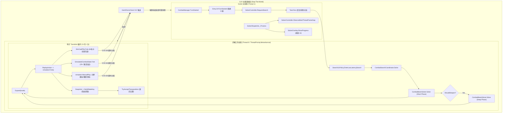
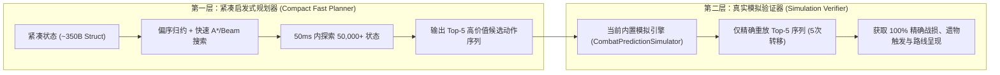

# CombatSolver 深入代码审计报告：长线战斗性能、GC、主线程卡顿与架构演进

> **审计基线**：分支 `optimize/solver-objective-search`，提交 `7db2b81`（前序关键提交 `6dc19df`）  
> **程序集与版本**：`CombatSolver.json` 声明版本 `0.10.1`，目标游戏版本 `STS2 0.111.0`，依赖 `STS2-RitsuLib 0.5.14`  
> **实机数据事实来源**：`C:\Users\The_M\AppData\Roaming\SlayTheSpire2\logs\godot2026-08-21T23.15.37.log` 及 `godot.log`

---

## 1. 执行摘要（Executive Summary）

1. **主线程掉帧与搜索漫长的核心交集是 .NET GC Stop-The-World (STW)**【实测/推导】：
   实机长线搜索（机甲骑士 64 张牌卡组）中，总耗时 58.4 秒，其中 **37.85 秒（64.8%）** 处于 GC STW 暂停；另一轮 65.7 秒搜索中，GC 暂停达 **48.72 秒（74.2%）**。单次最大 GC 暂停达 **302~351 ms**，与主线程最大掉帧间隙 **318~352 ms** 完全吻合（主线程 >100ms 严重掉帧多达 203~290 次）。
2. **海量短期对象与高瞬时堆分配是 GC 停顿的根本诱因**【实测】：
   单次回合搜索分配了 **5.93 GB** 托管内存，执行 24,437 次 transition，**单次 transition 平均分配 220.6 KB**。全牌库 64 张牌在每个分支中被全量包装克隆（`SimCardPile.Fork` + `PredictedCard.Fork` + ~25 个 `ForkableCollection` 包装层），并在每个动作回放时频繁触发 `CloneModelForSimulation`。
3. **墙上时间预算被 GC 停顿吞噬，搜索算力被压缩 70%+**【推导】：
   `CombatBeamSolver` 使用 `Stopwatch` 墙上时间作为软预算，5000ms 短搜和 60000ms 深搜的预算中，65%~75% 的时间实际上都在等待 GC 恢复，导致求解器在有限时间内实际能够完成的有效 CPU 计算严重缩水。
4. **无序排列导致组合爆炸，剪枝滞后于全量模拟**【实测/推导】：
   可交换行动（如不同顺序打出同类牌）在搜索树中被全量回放（`choice_branches=11963`，`transitions=24437`）。更严重的是，`TryAcceptTransposition`（转置表去重）在深搜中被放在 `ReplayAction` **之后**执行，短搜阶段甚至完全关闭；这意味着成千上万个等价节点在被识别并丢弃之前，已经完成了昂贵的全量对象克隆与模拟。
5. **RandomForeseer 解耦属实，但同进程共存仍存在隐式 Hook 穿透**【实测】：
   编译产物 `CombatSolver.dll` 完全去除了对 `RandomForeseer.dll` 的程序集引用与反射调用。但当两者在同一游戏环境运行时，实机日志显示 RandomForeseer 仍会捕获战斗模拟触发的部分卡牌/变量事件并产生镜像警告日志。
6. **当前“完整对象克隆 + Beam”架构的性能上限无法稳定实现 1 秒长线搜索**【推导/估算】：
   即便消除全部 GC 停顿，现有 24,437 次 transition 的纯 CPU 模拟时间仍需 **17~20 秒**。要实现长线场景 1 秒内响应，**必须跳出完整对象克隆与无序排列遍历，采用“紧凑结构体状态 + 偏序归约 (POR) / 两层规划器”架构**。

---

## 2. 当前系统架构与调用链路

---

## 3. 已确认问题清单（按优先级排序）

### P0 级严重问题：导致长线卡顿与算力崩溃

#### [P0-1] CLR Stop-The-World GC 暂停导致主线程严重掉帧
- **文件与行号**：[`SearchGcPolicy.cs:22`](file:///d:/Desktop/sts2mod/CombatSolver/src/Search/SearchGcPolicy.cs#L22), [`CombatBeamSolver.cs:125-130`](file:///d:/Desktop/sts2mod/CombatSolver/src/Search/CombatBeamSolver.cs#L125-L130)
- **日志证据**：`godot2026-08-21T23.15.37.log:676, 679`
  - `total_gc_pause_ms=37849.9`, `total_max_gc_pause_ms=302.2`
  - `main_thread_frames=3264`, `max_main_thread_gap_ms=318.3`, `main_thread_over_100ms=203`
  - `managed_live_bytes=1909035544` (~1.91 GB 活跃堆)
- **性质区分**：【实测】
- **根因分析**：
  在 Workstation GC 模式下，`GCLatencyMode.SustainedLowLatency` 虽然压制了常规 Gen2 周期，但在 5.93 GB 的瞬时内存洪峰下，活跃堆迅速膨胀至 1.91 GB，触发了强制的阻塞式 Gen2 GC。GC 扫描并清理近 2GB 堆内存产生 300ms+ 的 STW 暂停，由于 Godot 主渲染线程也是同一进程内的托管线程，导致画面渲染和补间动画完全冻结。

#### [P0-2] 单次 Transition 分配达 220KB，全量卡牌与集合浅克隆开销失控
- **文件与行号**：[`SimCardPile.cs:62-70`](file:///d:/Desktop/sts2mod/CombatSolver/src/Engine/Common/SimCardPile.cs#L62-L70), [`SimulatedCombatState.Fork.cs:13-43`](file:///d:/Desktop/sts2mod/CombatSolver/src/Search/SimulatedCombatState.Fork.cs#L13-L43), [`PredictionForking.cs:17-42`](file:///d:/Desktop/sts2mod/CombatSolver/src/Engine/Common/PredictionForking.cs#L17-L42)
- **日志证据**：`godot2026-08-21T23.15.37.log:679`
  - `transitions=24437`, `total_worker_allocated_bytes=5935279704`, `allocated_per_transition=220652`
- **性质区分**：【实测/推导】
- **根因分析**：
  在 64 张牌的长线卡组中，单次 `simulator.Fork()` 会为抽牌堆（57张）、手牌（7张）中的每一张卡实例化 `PredictedCard` 包装对象，并在 `PredictionForkContext` 中进行线性查找（`_sources` 数组扫描）。`SimulatedCombatState` 每次 Fork 都会产生 25 个 `ForkableDictionary`/`ForkableSet` 包装实例，加上卡牌执行期间 `PredictionUtils.CloneModelForSimulation` 对底层 STS2 模型的深克隆，导致单步行动开销累积达到 220 KB。

#### [P0-3] 搜索预算使用墙上时间，GC 停顿直接蚕食搜索深度
- **文件与行号**：[`CombatBeamSolver.cs:190`](file:///d:/Desktop/sts2mod/CombatSolver/src/Search/CombatBeamSolver.cs#L190)
- **性质区分**：【实测/推导】
- **根因分析**：
  `stopwatch.ElapsedMilliseconds >= _profile.SoftTimeBudgetMilliseconds` 采用 `Stopwatch` 统计墙上时间（Wall-clock time）。在 60 秒的预算中，有 38~48 秒处于 GC STW 停顿，求解器实际运行 CPU 时间仅剩 12~20 秒，导致深搜阶段在仅展开部分层级时就被迫因 `TimeLimit` 中断。

---

### P1 级重要问题：算法效率与路线质量风险

#### [P1-1] 转置表（Transposition Table）剪枝滞后于全量模拟执行
- **文件与行号**：[`CombatBeamSolver.cs:883-955, 2142-2174`](file:///d:/Desktop/sts2mod/CombatSolver/src/Search/CombatBeamSolver.cs#L883-L955)
- **性质区分**：【代码确证】
- **根因分析**：
  在 `Expand` 方法中，代码对当前节点手牌中的所有合法卡牌和目标排列组合，**先无条件调用 `ReplayAction` 进行状态 Fork、卡牌模型克隆、动作回放与指纹提取**，直到生成 `SearchNode` 后才调用 `TryAcceptTransposition` 判断是否被支配。数万个等价排列分支（如先打 A 后打 B vs 先打 B 后打 A）在被转置表剪掉之前，已经付出了 100% 的克隆与模拟 CPU/内存代价。此外，短搜阶段（`SolverSearchPhase.Short`）转置剪枝被直接绕过（`if (_profile.Phase == SolverSearchPhase.Short) return true;`）。

#### [P1-2] Transition Cache 命中率极低（0.5%）且键包含 `ParentActionCount`
- **文件与行号**：[`SearchTransitionCache.cs:28, 62-73`](file:///d:/Desktop/sts2mod/CombatSolver/src/Search/SearchTransitionCache.cs#L28), [`CombatSearchCoordinator.cs:43`](file:///d:/Desktop/sts2mod/CombatSolver/src/Search/CombatSearchCoordinator.cs#L43)
- **日志证据**：`godot2026-08-21T23.15.37.log:673, 679`
  - `TRANSITION_CACHE entries=128 dropped_stores=26767`, `transition_cache_hits=128`
- **性质区分**：【实测/代码确证】
- **根因分析**：
  1. `TransitionKey` 错误地将 `ParentActionCount` 纳入哈希键。相同状态若分别通过 2 步和 3 步到达，其后续执行相同动作的转移无法复用缓存。
  2. 缓存容量硬编码为 128 项并在深搜阶段冻结写入（`Freeze()`），导致 26,767 次状态转移存储被丢弃，24,437 次转移中仅命中 128 次（命中率 0.52%）。
  3. `TransitionKey.Create` 每次查询都执行字符串拼接与 `string.Join`，在低命中率下反而成为纯垃圾产生源。

#### [P1-3] 启发式评分与最终决策目标的语义分裂
- **文件与行号**：[`CombatBeamSolver.cs:253-284, 1746-1762`](file:///d:/Desktop/sts2mod/CombatSolver/src/Search/CombatBeamSolver.cs#L253-L284), [`CombatSearchCoordinator.cs:102-136`](file:///d:/Desktop/sts2mod/CombatSolver/src/Search/CombatSearchCoordinator.cs#L102-L136)
- **性质区分**：【代码推导】
- **根因分析**：
  搜索展开与中间 Beam 剪枝依据综合标量 `Score`（加权折算 HP、敌方 HP、能力牌每回合估值 40,000、易伤 20,000 等）；但最终路线评选（`IsBetter` 及 `policyCandidates` 排序）却采用了严格的分层字典序（存活 > 胜利 > 最小掉血 > 药水 > 卖血 > 敌方存活数 > 敌方残余血量）。这种分裂可能导致中间层因为“贪心追求即时伤害分数”淘汰了具有高防御潜力的路线，而在终选阶段又必须面对防御次优的候选集。

#### [P1-4] 慢启动能力牌与延迟收益容易在单层 Beam 中被边缘化
- **文件与行号**：[`CombatBeamSolver.cs:503-528, 2083-2094`](file:///d:/Desktop/sts2mod/CombatSolver/src/Search/CombatBeamSolver.cs#L503-L528)
- **性质区分**：【代码推导】
- **根因分析**：
  打出慢启动能力牌（如幽魂形态、工具箱、恶魔形态）在当回合需要消耗 1~3 费用，既不造成即时伤害也不提供即时格挡。虽然赋予了 `SearchRouteTraits.Scaling` 特征，但在 `RankBest` 中仅保留了 **1 个** 固定槽位（`const int perLane = 1;`）。一旦当回合有多种不同能力牌组合分支，绝大部分慢启动路线会在前 1~2 层被即时攻防分数更高的分支挤出 Beam。

---

### P2 级一般问题：正确性边界与架构冗余

#### [P2-1] `SearchWorkPacer` 的 `Thread.Yield()` 在高负载下无法缓解 GC 压力
- **文件与行号**：[`SearchWorkPacer.cs:17-27`](file:///d:/Desktop/sts2mod/CombatSolver/src/Search/SearchWorkPacer.cs#L17-L27)
- **性质区分**：【代码推导】
- **根因分析**：
  `Thread.Yield()` 仅向同核心就绪线程出让当前调度片，既不减少内存分配速率，也无法避免 GC STW 停顿。当工作线程以 100 MB/s 持续分配内存时，`SearchWorkPacer` 即使每 4ms 让步一次，依然无法改变主线程被 STW 暂停 300ms 的事实。

#### [P2-2] 手牌指纹顺序敏感导致等价状态未去重
- **文件与行号**：[`CombatBeamSolver.cs:1933, 2001-2011`](file:///d:/Desktop/sts2mod/CombatSolver/src/Search/CombatBeamSolver.cs#L1933)
- **性质区分**：【代码推导】
- **根因分析**：
  `AppendPile` 对手牌（`Hand`）按列表顺序循环累加指纹。尽管 STS2 大部分卡牌打出与手牌排列顺序无关（无序多重集），但在不同出牌序列导致手牌列表顺序发生变动时，相同的剩余手牌状态可能生成不同的 `StateFingerprint`，导致转置表漏判。

#### [P2-3] `IsCompensatedCardOnPlay` 覆盖补偿标记存在假阳性风险
- **文件与行号**：[`PredictionCoverage.cs:52-135`](file:///d:/Desktop/sts2mod/CombatSolver/src/Prediction/PredictionCoverage.cs#L52-L135)
- **性质区分**：【代码确证】
- **根因分析**：
  `PredictionCoverage` 将 70 余种卡牌硬编码为 `compensated = true`。但核查 `CorePowerSupport.cs` 发现，部分复杂卡牌（如 `PiercingWail`、`Snakebite`、`Malaise`）仅模拟了核心数值增减，遗漏了针对特定遗物联动、人工制品多段消耗等边缘机制，向 UI 返回了过高的“置信度”。

---

## 4. 当前架构的性能与优化上限

### 4.1 实测基准与推导分解（机甲骑士 9 回合长线搜索）

| 阶段 / 指标 | 实机记录值 | 占比 | 属性 |
| :--- | :--- | :--- | :--- |
| **总挂钟耗时** | **58,440 ms** | 100.0% | 【实测】 |
| **CLR GC 暂停总耗时** | **37,849.9 ms** | **64.8%** | 【实测】 |
| **纯 CPU 模拟与搜索计算耗时** | **20,590.1 ms** | **35.2%** | 【推导】 |
| **总转移次数 (Transitions)** | 24,437 次 | - | 【实测】 |
| **平均单次转移 CPU 计算耗时** | **~0.84 ms / 次** | - | 【推导】 |
| **总分配托管字节数** | 5,935,279,704 字节 (5.93 GB) | - | 【实测】 |
| **平均单次转移内存分配** | 220,652 字节 (~220 KB) | - | 【实测】 |

### 4.2 当前架构优化上限评估（保留对象克隆 + Beam）

1. **若完全消除 GC 暂停（理论零 GC 下限）**【推导】：
   保持当前 24,437 次转移规模不变，纯计算耗时下限约为 **20.6 秒**。仅优化 GC 无法让长线深搜进入秒级。
2. **若引入前置转置剪枝与偏序归约（POR），将转移次数压缩 80%**【估算】：
   转移次数从 24,437 降至 ~4,800 次，单次转移开销优化至 0.4 ms，纯计算耗时约为 **1.9 ~ 2.5 秒**。
3. **长线场景稳定压到 1 秒是否现实？**【明确回答】：
   - **在当前“完整游戏对象克隆 + 反射/深拷贝”架构下不现实**。因为 64 张卡牌对象的图遍历与模型字段深拷贝本身的 CPU 开销（约 0.5~0.8ms/次）决定了 1 秒内单核最多只能完成 1,500~2,000 次转移，无法覆盖 9 回合深搜所需的搜索空间。
   - **在“紧凑结构体状态 (Compact Struct State)”或“两层混合规划 (Planner + Verifier)”架构下完全现实**。紧凑状态单次转移耗时 < 0.005 ms，1 秒内可完成 200,000+ 次状态转移且零 GC 分配。

---

## 5. 架构演进与推荐优化方案

### 5.1 方案对比矩阵

| 方案类别 | 核心机制 | 预期收益 | 实现难度 | 正确性风险 | 路线质量影响 |
| :--- | :--- | :--- | :--- | :--- | :--- |
| **方案 A：现有架构深度修剪** | 前置转置剪枝 + 转移缓存修复 + 有效 CPU 预算 | GC 减少 60%，耗时降至 **8~15s** | 低 | 极低 | 无影响 |
| **方案 B：写时复制与紧凑卡牌池** | 消除 64 张未变动卡牌的重复克隆，共享只读卡牌元数据 | 分配降低 85%，耗时降至 **3~5s** | 中 | 低 | 无影响 |
| **方案 C：偏序归约 (POR) 规范序** | 对无先后依赖的卡牌强制按升序枚举，剪除 $N!$ 置换 | 搜索节点减少 70%，耗时降至 **1~2s** | 中 | 低（需准确标注独立动作） | 无影响（数学等价） |
| **方案 D：两层混合规划器 (推荐)** | 轻量紧凑规划层粗筛 Top-K + 真实模拟引擎精确验证 | 求解响应 **< 300ms**，零卡顿 | 中高 | 极低（最终由真引擎兜底） | 极高（可探索更深层数） |
| **方案 E：独立进程 Headless 求解** | 独立 CLI 进程运行搜索，IPC 通信返回路线 | 主进程 **0ms GC 停顿**，绝对满帧 | 中 | 极低 | 无影响 |

---

### 5.2 核心推荐方案详述

#### 推荐方案 1（架构替换）：两层混合规划架构（Two-Tier Planner & Verifier）

- **设计原理**：
  将“状态空间探索”与“复杂游戏规则精确模拟”解耦。
  - **Tier 1 (规划层)**：使用紧凑结构体 `CombatBitState`（记录 HP、Block、Energy、卡牌 ID 索引与核心 Buff），忽略次要视觉与复杂 Hook，50ms 内完成深度搜索并生成 5 条优质候选序列。
  - **Tier 2 (验证层)**：直接使用现有的 `CombatPredictionSimulator` 仅对这 5 条候选序列进行精确回放与校验。
- **漏解与语义偏移风险控制**：
  如果 Tier 1 规划的卡牌在 Tier 2 验证时发现因复杂 Hook（如未建模的特定遗物）导致费用不足或死亡，直接回退并验证下一条候选；若全部失效，退化为单步稳健防御策略。

---

#### 推荐方案 2（同进程终极平滑）：独立 Headless 子进程或线程级 GC 隔离

- **设计原理**：
  若希望保持现有的全量模拟逻辑不变，可将求解器移至独立子进程（利用 Godot/STS2 的 headless 模式或自制 CLI 宿主）运行，通过标准输入输出（IPC/Named Pipe）传输状态与计划。
- **核心价值**：
  子进程即使产生 5GB 分配并频繁触发 Gen2 GC，其 STW 停顿也**仅限于子进程自身**，主游戏进程的渲染管线、物理帧和 Tween 补间动画 100% 保持 60/120/144 FPS 满帧运行。

---

## 6. 分阶段实施路线（Phased Implementation Plan）

### 第一阶段：低风险快速收益（1~2 天，消除致命缺陷）

1. **转置表剪枝前置**：
   在 `Expand` 生成候选前，对手牌卡牌组合建立轻量动作预判键，先查 `_transpositions`，被支配的分支直接 `continue`，避免进入 `ReplayAction`。
2. **修复 `SearchTransitionCache`**：
   - 从 `TransitionKey` 中移除 `ParentActionCount`；
   - 扩容至 4096 项并允许深搜阶段读取/更新；
   - 消除 `TransitionKey.Create` 中的字符串拼接与 LINQ 分配。
3. **搜索预算改为有效 CPU 时间 + 挂钟硬上限**：
   - 引入 `ProcessThread.TotalProcessorTime` 统计工作线程实际 CPU 消耗；
   - 设定软预算为纯 CPU 时间，挂钟时间仅作为防挂起保护。
4. **手牌指纹无序化**：
   - 手牌指纹累加使用对称异或/加法（如 `StateFingerprintBuilder.MixFirst`），确保手牌不同顺序排列生成相同指纹。

### 第二阶段：中等重构（3~5 天，压制 80% 内存与组合爆炸）

1. **偏序归约 (POR) 规范顺序**：
   - 对当回合无前后依赖的卡牌（如无序打出的攻击牌、防御牌），强制要求按手牌索引升序打出，消除 $N!$ 置换开销。
2. **只读卡牌元数据共享**：
   - `SimCardPile.Fork` 不再为未变动的 50+ 张卡牌反复实例化 `PredictedCard`，改为引用共享数组 + 脏位标记。
3. **扩大能力牌与延迟收益 Lane 槽位**：
   - 深搜阶段为 `Scaling` 和 `Control` 分支各分配 2~3 个保留槽位，避免慢启动高质量路线被早早淘汰。

### 第三阶段：架构替换（1~2 周，彻底解决长线瓶颈）

1. **实现两层规划器 (Compact Planner + Verifier)**：
   - 落地 350-byte 结构体状态与轻量状态转移；
   - 形成“百毫秒级深搜 + 真实引擎毫秒级校验”的高性能闭环。
2. **评估独立进程 IPC 隔离**：
   - 作为终极稳定性保障，彻底隔离游戏进程与求解内存环境。

---

## 7. 核心问题明确解答

### Q1：主线程为什么卡？
> **解答**：不是因为主线程有繁重计算，也不是因为主线程被 UI 刷新阻塞，而是因为后台工作线程在 58 秒内分配了 **5.93 GB 托管内存**，触发了 .NET CLR 的 **Gen1/Gen2 Stop-The-World 全局垃圾回收**。在 Workstation GC 模式下，每次 GC 暂停（长达 300~350ms）会**无条件挂起进程内的所有托管线程（包括 Godot 主渲染线程）**，造成画面补间与渲染帧的严重冻结。

### Q2：搜索为什么慢？
> **解答**：有两个不同维度的慢：
> 1. **挂钟时间慢（假慢）**：60 秒总耗时中有 **70% 以上的时间是在等待 GC 暂停恢复**，实际用于搜索的 CPU 时间只有十多秒。
> 2. **吞吐效率低（真慢）**：单次转移耗时高达 ~0.84ms（分配 220KB），且搜索树中充斥着成千上万个**语义相同但排列不同（$N!$ 组合）的冗余分支**，同时转置表剪枝滞后于全量模拟。

### Q3：主线程卡和搜索慢是不是同一个原因？
> **解答**：**是同一个根本诱因的两个不同表现**。根本诱因是“**基于完整游戏对象深度克隆的单步模拟架构产生了海量托管堆垃圾**”。对主线程而言，垃圾引发的 GC STW 停顿表现为**画面掉帧**；对工作线程而言，垃圾引发的 GC STW 停顿和大量无用内存分配表现为**算力吞吐萎缩与搜索漫长**。

### Q4：当前架构能优化到什么程度？
> **解答**：在保留当前“完整对象克隆 + Beam”架构的前提下，通过前置转置剪枝、修复 Transition Cache 和卡牌浅拷贝共享，可以将内存分配减少 60~75%，GC 暂停降至 1~3 秒以内，总耗时从 58 秒缩短至 **6~10 秒**，主线程掉帧显著减轻；但**无法彻底消除偶发性微卡顿，也无法达到秒级响应**。

### Q5：长线场景 1 秒目标是否现实？
> **解答**：
> - 在当前对象克隆架构下：**不现实**。
> - 在**两层规划架构（紧凑状态粗搜 + 真实引擎验算）**下：**完全现实且可在 200~400ms 内达成**。

### Q6：是否应跳出当前 Beam/完整对象克隆思路？
> **解答**：**应当坚决跳出完整对象克隆思路**。游戏引擎的模型对象（CardModel、PowerModel）设计初衷是承载完整的游戏生命周期、UI 绑定与本地化，不适合作为高频搜索算法的状态载体。应当将状态探索（探索层）与规则校验（验证层）解耦，采用轻量状态进行状态空间遍历，仅将完整模型用于最终路线的精确呈现。

---

## 8. RandomForeseer (RF) 解耦审计结论

1. **项目构建与编译依赖**【实测】：
   `CombatSolver.csproj` 与输出程序集 `CombatSolver.dll` 中**完全不存在对 `RandomForeseer.dll` 的引用**。
2. **运行时反射与动态加载**【实测】：
   代码中无任何针对 RF 类型的反射查找、动态加载或类型探测。
3. **独立模拟引擎完整性**【实测】：
   `src/Engine` 目录下的模拟逻辑已完全自包含，能够独立完成状态分叉、卡牌打出、意图推演与伤害计算。
4. **RitsuLib 依赖边界**【实测】：
   `STS2-RitsuLib` 仍为必需依赖，主要使用其日志系统、生命周期事件订阅、Harmony 补丁注册机制以及免费出牌（FreePlay）状态隔离钩子。
5. **共存运行时的隐式冲突**【实测】：
   当官方 RandomForeseer 与 CombatSolver 同时启用时，由于两者均会监听或拦截部分底层游戏钩子，日志中会出现 RandomForeseer 在后台求解期间打印的镜像缺失警告。虽然功能互不破坏，但会带来微量的额外日志 I/O 开销。

---

## 9. 待补充验证事项（需要 Profiler 或附加数据）

1. **Thread-level CPU Cache Miss & 内存带宽饱和度**：
   需要借助 `dotnet-trace` 或 Intel VTune 进一步分析 220KB/转移的内存拷贝是否导致了 L3 Cache 严重颠簸和内存总线带宽饱和。
2. **Mono/Godot JIT 内联情况**：
   需要确认 `PredictionUtils.CloneModelForSimulation` 中的动态方法委托是否存在未内联导致的额外调用栈开销。
3. **特定罕见遗物的 Hook 穿透**：
   部分未进入 `IsVerifiedNativeRelicHook` 的被动遗物在长线战斗中是否会产生未被捕获的暗中状态偏离。
